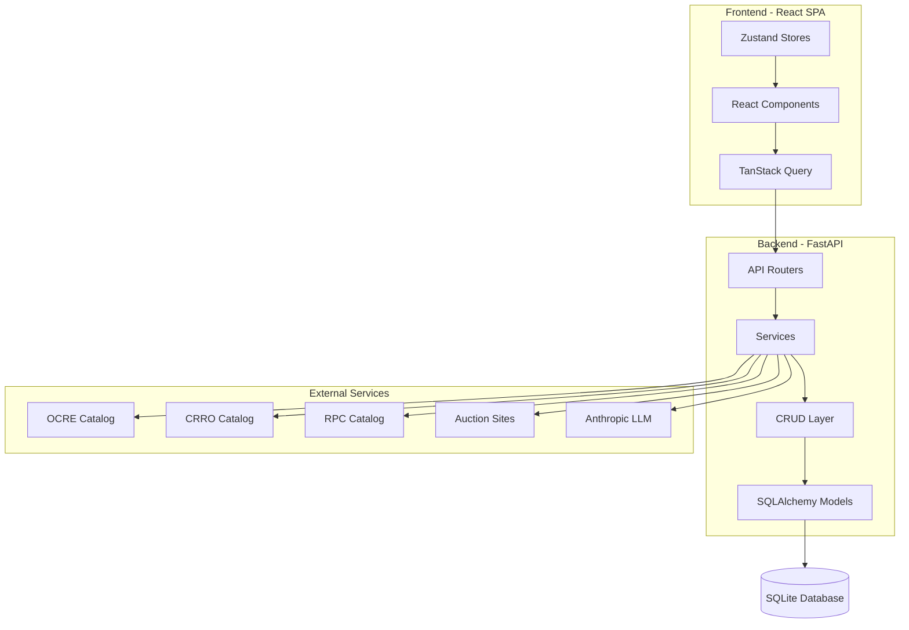
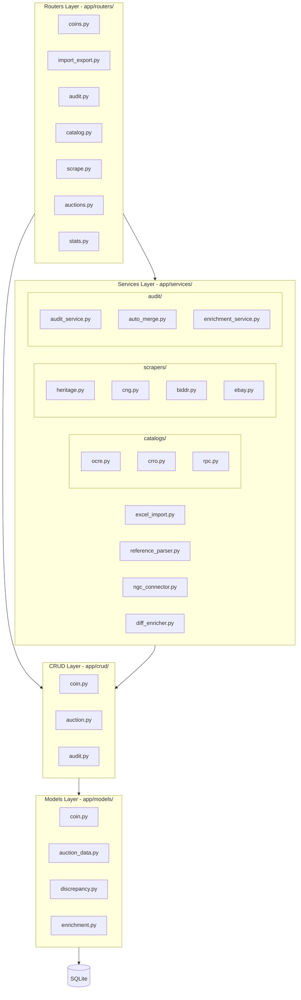
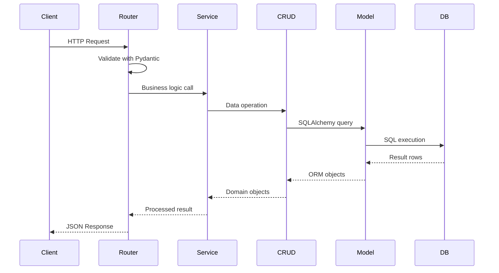
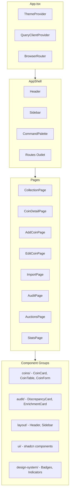
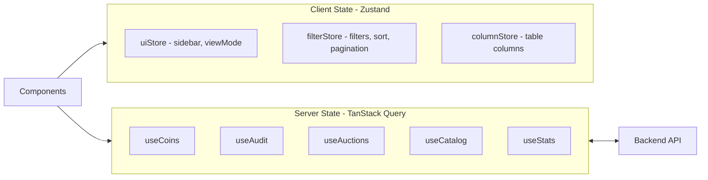
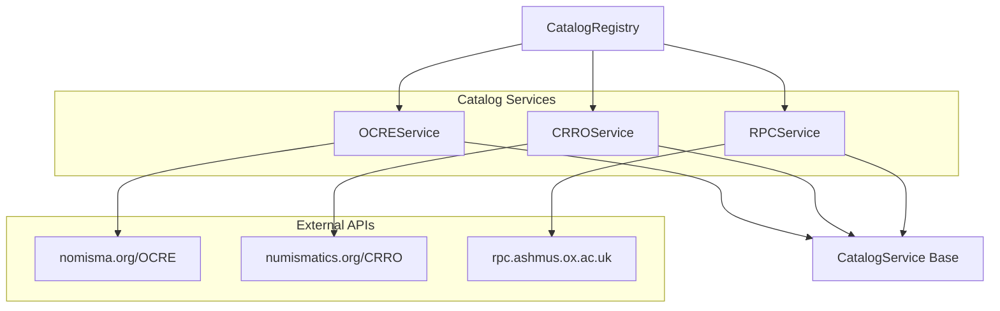
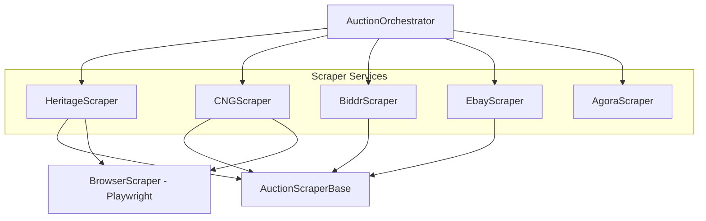
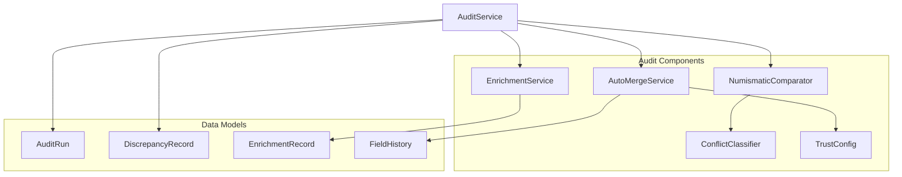
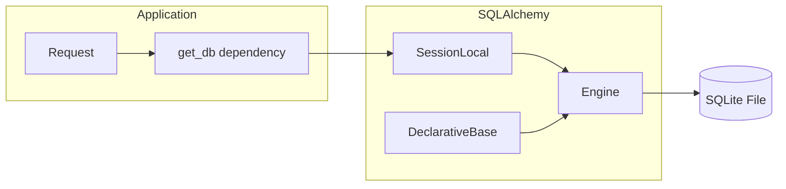

# System Architecture

## High-Level Overview

## Backend Architecture

### Layer Diagram

### Request Processing Flow

## Frontend Architecture

### Component Hierarchy

### State Management

## Service Dependencies

### Catalog Services

**Catalog API URLs:**

| Service | Reference System | API Base URL |
|---------|-----------------|--------------|
| OCRE | RIC (Imperial) | http://numismatics.org/ocre/ |
| CRRO | Crawford (Republican) | http://numismatics.org/crro/ |
| RPC | RPC (Provincial) | https://rpc.ashmus.ox.ac.uk/ |

### Scraper Services

**Scraper Target URLs:**

| Scraper | Target URL |
|---------|------------|
| HeritageScraper | https://coins.ha.com |
| CNGScraper | https://cngcoins.com |
| BiddrScraper | https://biddr.com |
| EbayScraper | https://www.ebay.com |
| AgoraScraper | https://agoraauctions.com |

### Audit Services

## Database Layer

### Connection Flow

### Key Entry Points

| Layer | Entry Point | File |
|-------|-------------|------|
| Backend | FastAPI app | `backend/app/main.py` |
| Database | Engine/Session | `backend/app/database.py` |
| Config | Settings | `backend/app/config.py` |
| Frontend | React app | `frontend/src/main.tsx` |
| Routes | Router setup | `frontend/src/App.tsx` |
| API Client | Axios | `frontend/src/lib/api.ts` |

## Key Architectural Patterns

### Backend Patterns

1. **Dependency Injection** - Database sessions via FastAPI `Depends()`
2. **Service Layer** - Business logic isolated from routers
3. **Repository Pattern** - CRUD functions abstract database operations
4. **Pydantic Validation** - Input/output schemas for all endpoints

### Frontend Patterns

1. **Server State** - TanStack Query manages API data
2. **Client State** - Zustand for UI-only state
3. **Colocation** - Hooks next to components that use them
4. **Composition** - Small, focused components assembled into pages

### Cross-Cutting Concerns

1. **Error Handling** - Global error handlers in FastAPI and Axios interceptors
2. **Caching** - TanStack Query with 5-minute stale time
3. **Persistence** - Zustand middleware for filterStore/columnStore
4. **CORS** - Configured for localhost development

---

**Previous:** [01-OVERVIEW.md](01-OVERVIEW.md) - Project overview  
**Next:** [03-BACKEND-MODULES.md](03-BACKEND-MODULES.md) - Backend module reference
