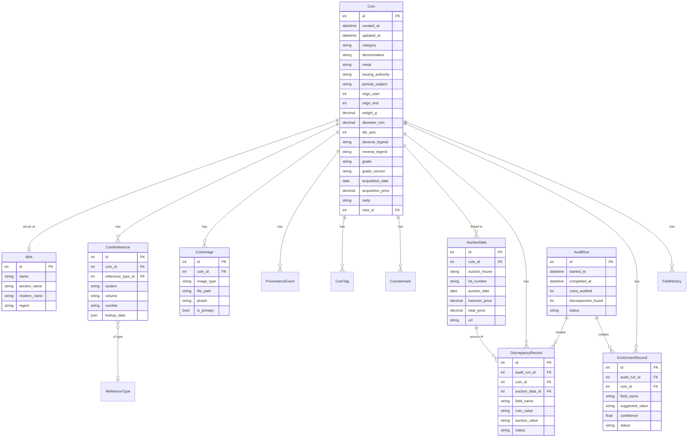

# Data Model Reference

> **Authoritative Source:** For the complete, detailed database schema with all 72 coin columns, see [`backend/SCHEMA.md`](../../backend/SCHEMA.md).
> 
> This document provides a quick reference. The backend SCHEMA.md contains full column specifications, constraints, indexes, and migration notes.

---

## Entity Relationship Diagram



---

## Core Tables

### `coins`

The central table storing all coin records.

| Column | Type | Nullable | Description |
|--------|------|----------|-------------|
| `id` | INTEGER | No | Primary key, auto-increment |
| `created_at` | DATETIME | No | Record creation timestamp |
| `updated_at` | DATETIME | No | Last update timestamp |
| **Classification** |
| `category` | VARCHAR | No | Enum: republic, imperial, provincial, byzantine, greek, other |
| `denomination` | VARCHAR | Yes | Coin type (Denarius, Aureus, etc.) |
| `metal` | VARCHAR | Yes | Enum: gold, silver, billon, bronze, orichalcum, copper |
| `series` | VARCHAR | Yes | Coin series/issue |
| **Attribution** |
| `issuing_authority` | VARCHAR | Yes | Who issued the coin (ruler name) |
| `portrait_subject` | VARCHAR | Yes | Person depicted (may differ from issuer) |
| `status` | VARCHAR | Yes | Title (Augustus, Caesar, etc.) |
| `mint_id` | INTEGER | Yes | FK to `mints` table |
| **Chronology** |
| `reign_start` | INTEGER | Yes | Start of reign (negative for BC) |
| `reign_end` | INTEGER | Yes | End of reign |
| `mint_year_start` | INTEGER | Yes | Earliest mint date |
| `mint_year_end` | INTEGER | Yes | Latest mint date |
| `dating_certainty` | VARCHAR | Yes | Enum: certain, probable, possible, unknown |
| **Physical** |
| `weight_g` | DECIMAL(6,3) | Yes | Weight in grams |
| `diameter_mm` | DECIMAL(5,2) | Yes | Diameter in millimeters |
| `die_axis` | INTEGER | Yes | Die orientation (1-12 clock hours) |
| **Design** |
| `obverse_legend` | TEXT | Yes | Text on front |
| `obverse_description` | TEXT | Yes | Description of obverse |
| `reverse_legend` | TEXT | Yes | Text on back |
| `reverse_description` | TEXT | Yes | Description of reverse |
| `exergue` | VARCHAR | Yes | Text in exergue area |
| **Grading** |
| `grade_service` | VARCHAR | Yes | Enum: ngc, pcgs, self, dealer |
| `grade` | VARCHAR | Yes | Grade string (VF, EF, AU, MS65, etc.) |
| `certification_number` | VARCHAR | Yes | Grading service cert number |
| `holder_type` | VARCHAR | Yes | Enum: slab, flip, envelope, raw |
| **Acquisition** |
| `acquisition_date` | DATE | Yes | Purchase date |
| `acquisition_price` | DECIMAL(12,2) | Yes | Purchase price |
| `acquisition_currency` | VARCHAR | Yes | Currency code (default: USD) |
| `acquisition_source` | VARCHAR | Yes | Where purchased |
| `acquisition_url` | VARCHAR | Yes | Purchase URL |
| **Collection** |
| `storage_location` | VARCHAR | Yes | Physical storage location |
| `current_value` | DECIMAL(12,2) | Yes | Estimated current value |
| `rarity` | VARCHAR | Yes | Enum: common, scarce, rare, very_rare, extremely_rare, unique |
| `historical_significance` | TEXT | Yes | Historical notes |
| `personal_notes` | TEXT | Yes | Personal notes |

**Indexes:**
- Primary key on `id`
- Index on `category`
- Index on `sub_category`
- Index on `denomination`
- Index on `metal`
- Index on `issuing_authority`
- Index on `portrait_subject`
- Index on `mint_id`

**Constraints:**
- `ck_die_axis_range`: `die_axis IS NULL OR (die_axis >= 0 AND die_axis <= 12)`

### Additional Coin Fields (Full Schema)

The `coins` table has **72 columns total**. Additional fields not shown above:

| Group | Fields |
|-------|--------|
| Sub-classification | `sub_category` |
| Chronology | `is_circa`, `dating_notes` |
| Physical | `diameter_min_mm`, `thickness_mm`, `orientation`, `is_test_cut` |
| Design | `obverse_legend_expanded`, `obverse_symbols`, `reverse_legend_expanded`, `reverse_symbols` |
| Mint | `officina`, `script` |
| Grading | `strike_quality`, `surface_quality`, `surface_issues` (JSON), `eye_appeal`, `toning_description`, `style_notes` |
| Valuation | `estimate_low`, `estimate_high`, `estimate_date`, `estimated_value_usd`, `insured_value` |
| Storage | `for_sale`, `asking_price` |
| Research | `rarity_notes`, `die_match_notes`, `provenance_notes` |
| Die Study | `die_study_obverse_id` (self-ref), `die_study_reverse_id` (self-ref), `die_study_group` |
| LLM | `llm_enriched` (JSON), `llm_enriched_at` |
| Auto-Merge | `field_sources` (JSON) |

> See [`backend/SCHEMA.md`](../../backend/SCHEMA.md) for complete column definitions.

---

### `mints`

Mint locations where coins were struck.

| Column | Type | Nullable | Description |
|--------|------|----------|-------------|
| `id` | INTEGER | No | Primary key |
| `name` | VARCHAR | No | Common name (Rome, Lugdunum) |
| `ancient_name` | VARCHAR | Yes | Ancient name |
| `modern_name` | VARCHAR | Yes | Modern city name |
| `region` | VARCHAR | Yes | Region/province |
| `country` | VARCHAR | Yes | Modern country |
| `latitude` | FLOAT | Yes | Geographic latitude |
| `longitude` | FLOAT | Yes | Geographic longitude |

---

### `coin_references`

Catalog reference citations for coins.

| Column | Type | Nullable | Description |
|--------|------|----------|-------------|
| `id` | INTEGER | No | Primary key |
| `coin_id` | INTEGER | No | FK to `coins` |
| `reference_type_id` | INTEGER | Yes | FK to `reference_types` |
| `system` | VARCHAR | No | Catalog system (RIC, Crawford, RPC) |
| `volume` | VARCHAR | Yes | Volume number (I, II, VII) |
| `number` | VARCHAR | No | Reference number (207, 335/1) |
| `page` | VARCHAR | Yes | Page reference |
| `plate` | VARCHAR | Yes | Plate reference |
| `variation` | VARCHAR | Yes | Sub-variation (a, b, c) |
| `note` | VARCHAR | Yes | Additional notes |
| `lookup_attempted` | BOOLEAN | No | Whether API lookup was tried |
| `lookup_success` | BOOLEAN | No | Whether lookup succeeded |
| `lookup_data` | JSON | Yes | Data from catalog API |

---

### `reference_types` (19 columns)

Catalog type records - single source of truth for reference data.

| Column | Type | Nullable | Description |
|--------|------|----------|-------------|
| `id` | INTEGER | No | Primary key |
| `created_at` | DATETIME | Yes | Creation timestamp |
| `updated_at` | DATETIME | Yes | Update timestamp |
| `system` | VARCHAR(20) | No | Catalog system (ric, crawford, rpc) |
| `local_ref` | VARCHAR(100) | No | Display reference (RIC I 207) |
| `local_ref_normalized` | VARCHAR(100) | No | Normalized key (ric.1.207) |
| `volume` | VARCHAR(20) | Yes | Volume (I, II, 1) |
| `number` | VARCHAR(50) | Yes | Number (207, 335/1c) |
| `edition` | VARCHAR(10) | Yes | Edition (2 for RIC I(2)) |
| `external_id` | VARCHAR(100) | Yes | OCRE/CRRO ID |
| `external_url` | VARCHAR(500) | Yes | Full catalog URL |
| `lookup_status` | VARCHAR(20) | Yes | pending, success, not_found |
| `lookup_confidence` | NUMERIC(3,2) | Yes | Match confidence (0.00-1.00) |
| `last_lookup` | DATETIME | Yes | Last lookup timestamp |
| `payload` | JSON | Yes | Cached catalog data |
| `citation` | TEXT | Yes | Generated citation |

**Constraints:**
- `uq_ref_type`: UNIQUE(system, local_ref_normalized)

---

### `reference_match_attempts`

Audit log for catalog matching attempts.

| Column | Type | Nullable | Description |
|--------|------|----------|-------------|
| `id` | INTEGER | No | Primary key |
| `reference_type_id` | INTEGER | Yes | FK to reference_types |
| `timestamp` | DATETIME | Yes | Attempt timestamp |
| `query_sent` | TEXT | Yes | Query sent to API |
| `context_used` | JSON | Yes | Coin context (ruler, mint) |
| `result_status` | VARCHAR(20) | Yes | success, not_found, error |
| `confidence` | NUMERIC(3,2) | Yes | Match confidence |
| `candidates_returned` | INTEGER | Yes | Number of candidates |

---

### `coin_images`

Images associated with coins.

| Column | Type | Nullable | Description |
|--------|------|----------|-------------|
| `id` | INTEGER | No | Primary key |
| `coin_id` | INTEGER | No | FK to `coins` |
| `image_type` | VARCHAR | No | Enum: obverse, reverse, combined, detail |
| `file_path` | VARCHAR | No | Path to image file |
| `original_filename` | VARCHAR | Yes | Original upload filename |
| `mime_type` | VARCHAR | Yes | MIME type |
| `phash` | VARCHAR | Yes | Perceptual hash for deduplication |
| `sort_order` | INTEGER | No | Display order |
| `is_primary` | BOOLEAN | No | Primary image flag |

---

### `provenance_events` (20 columns)

Tracks ownership history and auction appearances.

| Column | Type | Nullable | Description |
|--------|------|----------|-------------|
| `id` | INTEGER | No | Primary key |
| `coin_id` | INTEGER | No | FK to `coins` |
| `event_type` | ENUM | No | ProvenanceType enum |
| `event_date` | DATE | Yes | Event date |
| `auction_house` | VARCHAR(100) | Yes | Auction house name |
| `sale_series` | VARCHAR(50) | Yes | Sale series (Triton) |
| `sale_number` | VARCHAR(20) | Yes | Sale number (XXIV) |
| `lot_number` | VARCHAR(20) | Yes | Lot number |
| `catalog_reference` | VARCHAR(200) | Yes | Full citation |
| `hammer_price` | NUMERIC(10,2) | Yes | Hammer price |
| `buyers_premium_pct` | NUMERIC(4,2) | Yes | Buyer's premium % |
| `total_price` | NUMERIC(10,2) | Yes | Total with premium |
| `currency` | VARCHAR(3) | Yes | Currency code |
| `dealer_name` | VARCHAR(100) | Yes | Dealer name |
| `collection_name` | VARCHAR(100) | Yes | Named collection |
| `url` | VARCHAR(500) | Yes | URL to listing |
| `receipt_available` | BOOLEAN | Yes | Has receipt |
| `notes` | TEXT | Yes | Additional notes |
| `sort_order` | INTEGER | Yes | Display order |
| `auction_data_id` | INTEGER | Yes | FK to auction_data |

---

### `coin_tags`

Custom tags for coins.

| Column | Type | Nullable | Description |
|--------|------|----------|-------------|
| `id` | INTEGER | No | Primary key |
| `coin_id` | INTEGER | No | FK to `coins` |
| `tag` | VARCHAR | No | Tag text |

---

### `countermarks`

Countermark stamps on coins.

| Column | Type | Nullable | Description |
|--------|------|----------|-------------|
| `id` | INTEGER | No | Primary key |
| `coin_id` | INTEGER | No | FK to `coins` |
| `countermark_type` | VARCHAR | Yes | Type (validation, military, etc.) |
| `description` | TEXT | Yes | Countermark description |
| `placement` | VARCHAR | Yes | obverse/reverse |
| `condition` | VARCHAR | Yes | clear/partial/worn |

---

## Auction Tables

### `auction_data` (74 columns)

Comprehensive auction record data for enrichment and price comparison.

> **Full schema:** See [`backend/SCHEMA.md`](../../backend/SCHEMA.md) for all 74 columns.

| Column | Type | Nullable | Description |
|--------|------|----------|-------------|
| `id` | INTEGER | No | Primary key |
| `created_at` | DATETIME | Yes | Creation timestamp |
| `updated_at` | DATETIME | Yes | Update timestamp |
| `coin_id` | INTEGER | Yes | FK to `coins` (nullable for unlinked) |
| **Auction Identity** |
| `auction_house` | VARCHAR(100) | No | House name |
| `sale_name` | VARCHAR(200) | Yes | Sale name |
| `lot_number` | VARCHAR(50) | Yes | Lot number |
| `source_lot_id` | VARCHAR(50) | Yes | External lot ID |
| `auction_date` | DATE | Yes | Auction date |
| `url` | VARCHAR(500) | No | Listing URL (unique) |
| **Pricing** |
| `estimate_low` | NUMERIC(10,2) | Yes | Low estimate |
| `estimate_high` | NUMERIC(10,2) | Yes | High estimate |
| `hammer_price` | NUMERIC(10,2) | Yes | Hammer price |
| `total_price` | NUMERIC(10,2) | Yes | Total with premium |
| `buyers_premium_pct` | NUMERIC(4,2) | Yes | Premium % |
| `currency` | VARCHAR(3) | Yes | Currency code |
| `sold` | BOOLEAN | Yes | Sold flag |
| `bids` | INTEGER | Yes | Bid count |
| **Classification** |
| `ruler` | VARCHAR(200) | Yes | Ruler name |
| `denomination` | VARCHAR(100) | Yes | Denomination |
| `metal` | VARCHAR(20) | Yes | Metal |
| `mint` | VARCHAR(100) | Yes | Mint |
| **Physical** |
| `weight_g` | NUMERIC(6,3) | Yes | Weight |
| `diameter_mm` | NUMERIC(5,2) | Yes | Diameter |
| `die_axis` | INTEGER | Yes | Die axis (hours) |
| **Descriptions** |
| `title` | VARCHAR(1000) | Yes | Full title |
| `description` | TEXT | Yes | Full description |
| `obverse_description` | TEXT | Yes | Obverse |
| `reverse_description` | TEXT | Yes | Reverse |
| **Grading** |
| `grade` | VARCHAR(50) | Yes | Grade |
| `grade_service` | VARCHAR(20) | Yes | Service |
| `certification_number` | VARCHAR(50) | Yes | Cert number |
| **References** |
| `catalog_references` | JSON | Yes | Parsed refs |
| `primary_reference` | VARCHAR(100) | Yes | Primary ref |
| `reference_type_id` | INTEGER | Yes | FK to reference_types |
| **Photos** |
| `photos` | JSON | Yes | Photo URLs |
| `primary_photo_url` | VARCHAR(500) | Yes | Main photo |
| **Metadata** |
| `scraped_at` | DATETIME | Yes | Scrape timestamp |
| `raw_data` | JSON | Yes | Raw response |

**Additional Fields:** eBay seller info, provenance, legends, campaign tracking (see full schema)

**Constraints:**
- `url` is UNIQUE

**Indexes:**
- `ix_auction_data_auction_house`
- `ix_auction_data_source_lot_id`
- `ix_auction_data_auction_date`
- `ix_auction_data_url`
- `ix_auction_data_reference_type_id`

---

### `price_history` (13 columns)

Price trends aggregated by reference type.

| Column | Type | Nullable | Description |
|--------|------|----------|-------------|
| `id` | INTEGER | No | Primary key |
| `created_at` | DATETIME | Yes | Creation timestamp |
| `reference_type_id` | INTEGER | No | FK to reference_types |
| `period_date` | DATE | No | Period start date |
| `period_type` | VARCHAR(20) | Yes | Period type |
| `min_price` | NUMERIC(10,2) | Yes | Minimum price |
| `max_price` | NUMERIC(10,2) | Yes | Maximum price |
| `median_price` | NUMERIC(10,2) | Yes | Median price |
| `mean_price` | NUMERIC(10,2) | Yes | Mean price |
| `comp_count` | INTEGER | Yes | Total sales |
| `sold_count` | INTEGER | Yes | Sold count |
| `passed_count` | INTEGER | Yes | Unsold count |
| `median_price_vf_adj` | NUMERIC(10,2) | Yes | VF-adjusted median |

**Constraints:**
- `uq_price_history_period`: UNIQUE(reference_type_id, period_date, period_type)

---

## Audit Tables

### `audit_runs` (16 columns)

Tracks audit execution sessions.

| Column | Type | Nullable | Description |
|--------|------|----------|-------------|
| `id` | INTEGER | No | Primary key |
| `started_at` | DATETIME | No | Start time |
| `completed_at` | DATETIME | Yes | Completion time |
| `scope` | VARCHAR(20) | No | Scope (single, all, selected) |
| `coin_ids` | JSON | Yes | Target coin IDs |
| `total_coins` | INTEGER | Yes | Total to audit |
| `coins_audited` | INTEGER | Yes | Audited count |
| `coins_with_issues` | INTEGER | Yes | Issues found |
| `discrepancies_found` | INTEGER | Yes | Discrepancy count |
| `enrichments_found` | INTEGER | Yes | Enrichment count |
| `images_downloaded` | INTEGER | Yes | Images downloaded |
| `auto_accepted` | INTEGER | Yes | Auto-accepted |
| `auto_applied` | INTEGER | Yes | Auto-applied |
| `status` | VARCHAR(20) | No | Status |
| `error_message` | TEXT | Yes | Error message |
| `config_snapshot` | JSON | Yes | Config at runtime |

---

### `discrepancy_records` (20 columns)

Records data conflicts between coins and auction data.

| Column | Type | Nullable | Description |
|--------|------|----------|-------------|
| `id` | INTEGER | No | Primary key |
| `created_at` | DATETIME | No | Creation time |
| `coin_id` | INTEGER | No | FK to `coins` |
| `auction_data_id` | INTEGER | Yes | FK to `auction_data` |
| `audit_run_id` | INTEGER | Yes | FK to `audit_runs` |
| `field_name` | VARCHAR(50) | No | Field being compared |
| `current_value` | TEXT | Yes | Current value |
| `auction_value` | TEXT | Yes | Auction value |
| `similarity` | FLOAT | Yes | Similarity score |
| `difference_type` | VARCHAR(30) | Yes | Difference type |
| `comparison_notes` | TEXT | Yes | Comparison notes |
| `normalized_current` | TEXT | Yes | Normalized current |
| `normalized_auction` | TEXT | Yes | Normalized auction |
| `source_house` | VARCHAR(50) | No | Source house |
| `trust_level` | VARCHAR(20) | No | Trust level |
| `auto_acceptable` | BOOLEAN | Yes | Auto-accept flag |
| `status` | VARCHAR(20) | No | Resolution status |
| `resolved_at` | DATETIME | Yes | Resolution time |
| `resolution` | VARCHAR(20) | Yes | Resolution action |
| `resolution_notes` | TEXT | Yes | Resolution notes |

**Indexes:**
- `ix_discrepancy_status_trust` (status, trust_level)
- `ix_discrepancy_coin_status` (coin_id, status)

---

### `enrichment_records` (15 columns)

Tracks suggested field updates from auction data.

| Column | Type | Nullable | Description |
|--------|------|----------|-------------|
| `id` | INTEGER | No | Primary key |
| `created_at` | DATETIME | No | Creation time |
| `coin_id` | INTEGER | No | FK to `coins` |
| `auction_data_id` | INTEGER | Yes | FK to `auction_data` |
| `audit_run_id` | INTEGER | Yes | FK to `audit_runs` |
| `field_name` | VARCHAR(50) | No | Field to enrich |
| `suggested_value` | TEXT | No | Suggested value |
| `source_house` | VARCHAR(50) | No | Source house |
| `trust_level` | VARCHAR(20) | No | Trust level |
| `confidence` | FLOAT | Yes | Confidence score |
| `auto_applicable` | BOOLEAN | Yes | Auto-apply flag |
| `status` | VARCHAR(20) | No | Status |
| `applied_at` | DATETIME | Yes | Application time |
| `applied` | BOOLEAN | Yes | Applied flag |
| `rejection_reason` | TEXT | Yes | Rejection reason |

**Indexes:**
- `ix_enrichment_status_trust` (status, trust_level)
- `ix_enrichment_coin_status` (coin_id, status)

---

### `field_history` (17 columns)

Audit trail for field changes with rollback support.

| Column | Type | Nullable | Description |
|--------|------|----------|-------------|
| `id` | INTEGER | No | Primary key |
| `coin_id` | INTEGER | No | FK to `coins` |
| `field_name` | VARCHAR(50) | No | Changed field |
| `old_value` | JSON | Yes | Previous value |
| `new_value` | JSON | Yes | New value |
| `old_source` | VARCHAR(50) | Yes | Previous source |
| `new_source` | VARCHAR(50) | Yes | New source |
| `old_source_id` | VARCHAR(100) | Yes | Previous source ID |
| `new_source_id` | VARCHAR(100) | Yes | New source ID |
| `change_type` | VARCHAR(20) | No | Type (auto_fill, manual) |
| `changed_at` | DATETIME | No | Change timestamp |
| `changed_by` | VARCHAR(100) | Yes | Who made change |
| `batch_id` | VARCHAR(36) | Yes | Batch UUID |
| `conflict_type` | VARCHAR(50) | Yes | Conflict type |
| `trust_old` | INTEGER | Yes | Old trust level |
| `trust_new` | INTEGER | Yes | New trust level |
| `reason` | VARCHAR(500) | Yes | Change reason |

**Indexes:**
- `ix_field_history_batch_coin` (batch_id, coin_id)
- `ix_field_history_coin_field` (coin_id, field_name)

---

### `image_auction_sources`

Tracks which auctions an image appeared in.

| Column | Type | Nullable | Description |
|--------|------|----------|-------------|
| `id` | INTEGER | No | Primary key |
| `created_at` | DATETIME | No | Creation time |
| `image_id` | INTEGER | No | FK to coin_images |
| `auction_data_id` | INTEGER | No | FK to auction_data |
| `source_url` | VARCHAR(500) | No | Original URL |
| `source_house` | VARCHAR(50) | Yes | Source house |
| `fetched_at` | DATETIME | Yes | Fetch timestamp |

---

### `import_records` (13 columns)

Tracks provenance of imported coins.

| Column | Type | Nullable | Description |
|--------|------|----------|-------------|
| `id` | INTEGER | No | Primary key |
| `coin_id` | INTEGER | No | FK to `coins` |
| `source_type` | VARCHAR(50) | No | Source type |
| `source_id` | VARCHAR(100) | Yes | Source identifier |
| `source_url` | VARCHAR(500) | Yes | Source URL |
| `imported_at` | DATETIME | No | Import timestamp |
| `raw_data` | JSON | Yes | Original data |
| `import_method` | VARCHAR(50) | Yes | Import method |
| `imported_by` | VARCHAR(100) | Yes | Importer |
| `file_name` | VARCHAR(255) | Yes | Source file |
| `file_row` | INTEGER | Yes | Source row |
| `enriched_at` | DATETIME | Yes | Enrichment time |
| `enrichment_source` | VARCHAR(50) | Yes | Enrichment source |

**Constraints:**
- `uq_import_source`: UNIQUE(source_type, source_id)

**Indexes:**
- `ix_import_source_lookup` (source_type, source_id)

---

## Enum Values Quick Reference

> **Full enum definitions:** See [`backend/SCHEMA.md`](../../backend/SCHEMA.md) for complete enum values.

### Category
```
greek | celtic | republic | imperial | provincial | judaean | byzantine | migration | pseudo_roman | other
```

### Metal
```
gold | electrum | silver | billon | potin | orichalcum | bronze | copper | lead | ae | uncertain
```

### Rarity
```
common | scarce | rare | very_rare | extremely_rare | unique
```

### GradeService
```
ngc | pcgs | self | dealer
```

### HolderType
```
ngc_slab | pcgs_slab | flip | capsule | tray | raw
```

### DatingCertainty
```
exact | narrow | broad | unknown
```

### ImageType
```
obverse | reverse | edge | slab | detail | combined | other
```

### ProvenanceType
```
auction | private_sale | dealer | find | inheritance | gift | collection | exchange
```

### ReferenceSystem
```
ric | crawford | rpc | rsc | bmcre | sear | sydenham | sng | bmc | hn | other
```

### ReferencePosition
```
obverse | reverse | both
```

### CountermarkType
```
host_validation | value_reduction | military | civic | imperial | other
```

### CountermarkCondition
```
clear | partial | worn | uncertain
```

### ImportSourceType
```
heritage | cng | ebay | biddr | roma | agora | ngc | pcgs | vcoins | ma_shops | file | manual
```

### DiscrepancyStatus
```
pending | accepted | rejected | ignored
```

### EnrichmentStatus
```
pending | applied | rejected
```

### DifferenceType
```
measurement | grade | reference | text
```

### Severity
```
low | medium | high
```

---

## Common Query Patterns

### Get coin with all relationships

```python
stmt = (
    select(Coin)
    .options(
        joinedload(Coin.mint),
        selectinload(Coin.references),
        selectinload(Coin.images),
        selectinload(Coin.provenance_events),
        selectinload(Coin.tags),
    )
    .where(Coin.id == coin_id)
)
coin = db.execute(stmt).scalar_one_or_none()
```

### Filter coins by multiple criteria

```python
stmt = select(Coin)

if category:
    stmt = stmt.where(Coin.category == category)
if metal:
    stmt = stmt.where(Coin.metal == metal)
if ruler:
    stmt = stmt.where(Coin.issuing_authority.ilike(f"%{ruler}%"))
if year_start:
    stmt = stmt.where(Coin.reign_end >= year_start)
if year_end:
    stmt = stmt.where(Coin.reign_start <= year_end)

stmt = stmt.order_by(getattr(Coin, sort_by).desc())
stmt = stmt.offset(skip).limit(limit)

coins = db.execute(stmt).scalars().all()
```

### Get auction comparables

```python
stmt = (
    select(AuctionData)
    .where(AuctionData.ruler.ilike(f"%{coin.issuing_authority}%"))
    .where(AuctionData.denomination == coin.denomination)
    .where(AuctionData.coin_id != coin.id)
    .order_by(AuctionData.auction_date.desc())
    .limit(10)
)
comparables = db.execute(stmt).scalars().all()
```

### Get pending discrepancies for coin

```python
stmt = (
    select(DiscrepancyRecord)
    .where(DiscrepancyRecord.coin_id == coin_id)
    .where(DiscrepancyRecord.status == "pending")
    .order_by(DiscrepancyRecord.severity.desc())
)
discrepancies = db.execute(stmt).scalars().all()
```

---

## SQLAlchemy Notes

### Database Configuration

```python
# Database URL format
DATABASE_URL = "sqlite:///./data/coinstack.db"

# Engine configuration
engine = create_engine(
    DATABASE_URL,
    connect_args={"check_same_thread": False},  # SQLite-specific
    echo=False,  # Set True for SQL logging
)
```

### Enum Handling (SQLAlchemy 2.0)

SQLAlchemy 2.0 stores enum **member names** (uppercase), not values:
- Database stores: `IMPERIAL`, `SILVER`, `OBVERSE_UP`
- Not the values: `imperial`, `silver`, `obverse_up`

### Session Management

```python
from app.database import get_db

# In FastAPI endpoints
def my_endpoint(db: Session = Depends(get_db)):
    coins = db.query(Coin).all()
```

### Migration Notes

**Adding Columns:**
```python
conn.execute(text("ALTER TABLE coins ADD COLUMN new_field VARCHAR(100)"))
```

**Adding Indexes:**
```python
conn.execute(text("CREATE INDEX IF NOT EXISTS ix_name ON table (column)"))
```

**Adding Unique Constraints:**
```python
conn.execute(text("CREATE UNIQUE INDEX IF NOT EXISTS uq_name ON table (col1, col2)"))
```

> **Note:** SQLite doesn't support DROP COLUMN. Use table recreation for column removal.

---

**Previous:** [04-FRONTEND-MODULES.md](04-FRONTEND-MODULES.md) - Frontend reference  
**Next:** [06-DATA-FLOWS.md](06-DATA-FLOWS.md) - Data flows and sequences
