# Data Flows (V2 Clean Architecture)

> This document shows request flows and state management using V2 Clean Architecture patterns.
>
> **Key Pattern**: Router → Use Case → Repository (Interface) → Domain Entity

---

## V2 Architecture Flow

All backend flows follow Clean Architecture:

```
┌─────────┐     ┌──────────┐     ┌────────────┐     ┌────────────┐
│ Router  │ --> │ Use Case │ --> │ Repository │ --> │   Domain   │
│ (Web)   │     │ (App)    │     │ Interface  │     │   Entity   │
└─────────┘     └──────────┘     └────────────┘     └────────────┘
    │                 │                 │                   │
    │                 │                 ↓                   │
    │                 │          ┌────────────┐            │
    │                 │          │ ORM Model  │            │
    │                 │          │(Infra)     │            │
    │                 │          └────────────┘            │
    │                 │                 │                   │
    │                 │                 ↓                   │
    │                 │            ┌────────┐              │
    │                 └───────────>│   DB   │<─────────────┘
    │                              └────────┘
    │
    ↓
get_db() manages transactions automatically
```

**Critical Rules**:
- Domain entities have NO database dependencies
- Use cases depend on repository interfaces (Protocols)
- Repositories convert between ORM models and domain entities
- Repositories use `flush()` NOT `commit()`
- `get_db()` dependency handles transaction commit/rollback

---

## Coin CRUD Flow (V2)

### Create Coin

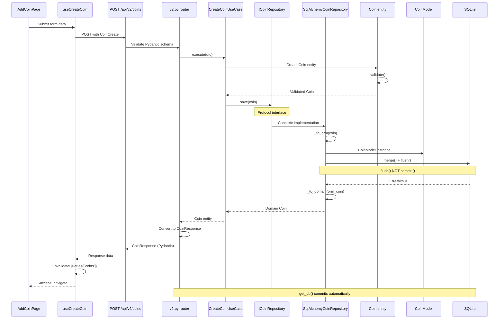
```mermaid
sequenceDiagram
    participant UI as AddCoinPage
    participant Hook as useCreateCoin
    participant API as POST /api/v2/coins
    participant Router as v2.py router
    participant UseCase as CreateCoinUseCase
    participant Repo as ICoinRepository
    participant RepoImpl as SqlAlchemyCoinRepository
    participant Domain as Coin entity
    participant ORM as CoinModel
    participant DB as SQLite

    UI->>Hook: Submit form data
    Hook->>API: POST with CoinCreate
    API->>Router: Validate Pydantic schema
    Router->>UseCase: execute(dto)
    UseCase->>Domain: Create Coin entity
    Domain->>Domain: validate()
    Domain-->>UseCase: Validated Coin
    UseCase->>Repo: save(coin)
    Note over Repo: Protocol interface
    Repo->>RepoImpl: Concrete implementation
    RepoImpl->>RepoImpl: _to_orm(coin)
    RepoImpl->>ORM: CoinModel instance
    RepoImpl->>DB: merge() + flush()
    Note over RepoImpl,DB: flush() NOT commit()
    DB-->>RepoImpl: ORM with ID
    RepoImpl->>RepoImpl: _to_domain(orm_coin)
    RepoImpl-->>UseCase: Domain Coin
    UseCase-->>Router: Coin entity
    Router->>Router: Convert to CoinResponse
    Router-->>API: CoinResponse (Pydantic)
    API-->>Hook: Response data
    Hook->>Hook: invalidateQueries(['coins'])
    Hook-->>UI: Success, navigate
    Note over Router,DB: get_db() commits automatically
```

### Update Coin

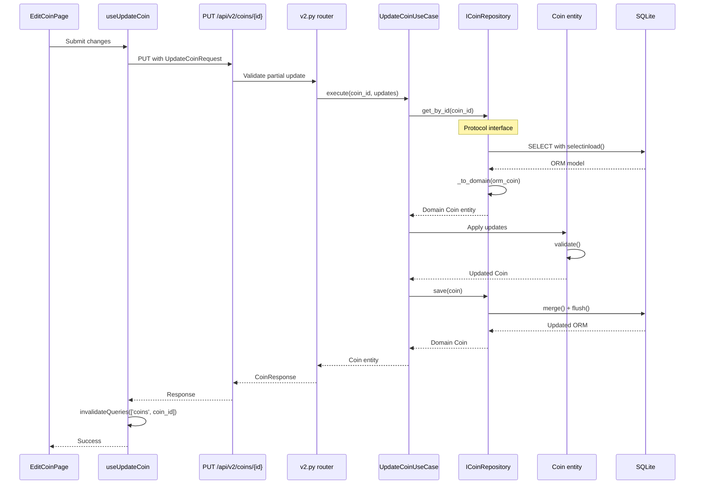
```mermaid
sequenceDiagram
    participant UI as EditCoinPage
    participant Hook as useUpdateCoin
    participant API as PUT /api/v2/coins/{id}
    participant Router as v2.py router
    participant UseCase as UpdateCoinUseCase
    participant Repo as ICoinRepository
    participant Domain as Coin entity
    participant DB as SQLite

    UI->>Hook: Submit changes
    Hook->>API: PUT with UpdateCoinRequest
    API->>Router: Validate partial update
    Router->>UseCase: execute(coin_id, updates)
    UseCase->>Repo: get_by_id(coin_id)
    Note over Repo: Protocol interface
    Repo->>DB: SELECT with selectinload()
    DB-->>Repo: ORM model
    Repo->>Repo: _to_domain(orm_coin)
    Repo-->>UseCase: Domain Coin entity
    UseCase->>Domain: Apply updates
    Domain->>Domain: validate()
    Domain-->>UseCase: Updated Coin
    UseCase->>Repo: save(coin)
    Repo->>DB: merge() + flush()
    DB-->>Repo: Updated ORM
    Repo-->>UseCase: Domain Coin
    UseCase-->>Router: Coin entity
    Router-->>API: CoinResponse
    API-->>Hook: Response
    Hook->>Hook: invalidateQueries(['coins', coin_id])
    Hook-->>UI: Success
```

### List Coins with Filters (V2)

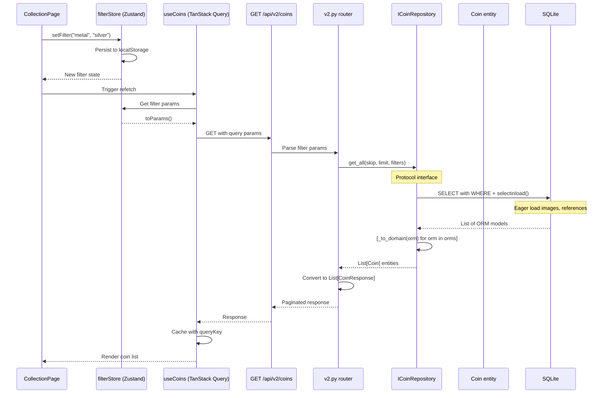
```mermaid
sequenceDiagram
    participant UI as CollectionPage
    participant FilterStore as filterStore (Zustand)
    participant Hook as useCoins (TanStack Query)
    participant API as GET /api/v2/coins
    participant Router as v2.py router
    participant Repo as ICoinRepository
    participant Domain as Coin entity
    participant DB as SQLite

    UI->>FilterStore: setFilter("metal", "silver")
    FilterStore->>FilterStore: Persist to localStorage
    FilterStore-->>UI: New filter state
    UI->>Hook: Trigger refetch
    Hook->>FilterStore: Get filter params
    FilterStore-->>Hook: toParams()
    Hook->>API: GET with query params
    API->>Router: Parse filter params
    Router->>Repo: get_all(skip, limit, filters)
    Note over Repo: Protocol interface
    Repo->>DB: SELECT with WHERE + selectinload()
    Note over DB: Eager load images, references
    DB-->>Repo: List of ORM models
    Repo->>Repo: [_to_domain(orm) for orm in orms]
    Repo-->>Router: List[Coin] entities
    Router->>Router: Convert to List[CoinResponse]
    Router-->>API: Paginated response
    API-->>Hook: Response
    Hook->>Hook: Cache with queryKey
    Hook-->>UI: Render coin list
```

---

## Vocabulary Flow (V3)

### Normalize Text to Vocabulary Term

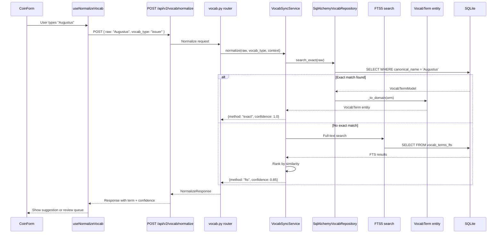
```mermaid
sequenceDiagram
    participant UI as CoinForm
    participant Hook as useNormalizeVocab
    participant API as POST /api/v2/vocab/normalize
    participant Router as vocab.py router
    participant Service as VocabSyncService
    participant Repo as SqlAlchemyVocabRepository
    participant FTS as FTS5 search
    participant Domain as VocabTerm entity
    participant DB as SQLite

    UI->>Hook: User types "Augustus"
    Hook->>API: POST { raw: "Augustus", vocab_type: "issuer" }
    API->>Router: Normalize request
    Router->>Service: normalize(raw, vocab_type, context)

    Service->>Repo: search_exact(raw)
    Repo->>DB: SELECT WHERE canonical_name = 'Augustus'

    alt Exact match found
        DB-->>Repo: VocabTermModel
        Repo->>Domain: _to_domain(orm)
        Domain-->>Service: VocabTerm entity
        Service-->>Router: {method: "exact", confidence: 1.0}
    else No exact match
        Service->>FTS: Full-text search
        FTS->>DB: SELECT FROM vocab_terms_fts
        DB-->>Service: FTS results
        Service->>Service: Rank by similarity
        Service-->>Router: {method: "fts", confidence: 0.85}
    end

    Router-->>API: NormalizeResponse
    API-->>Hook: Response with term + confidence
    Hook-->>UI: Show suggestion or review queue
```

### Bulk Normalize Coins

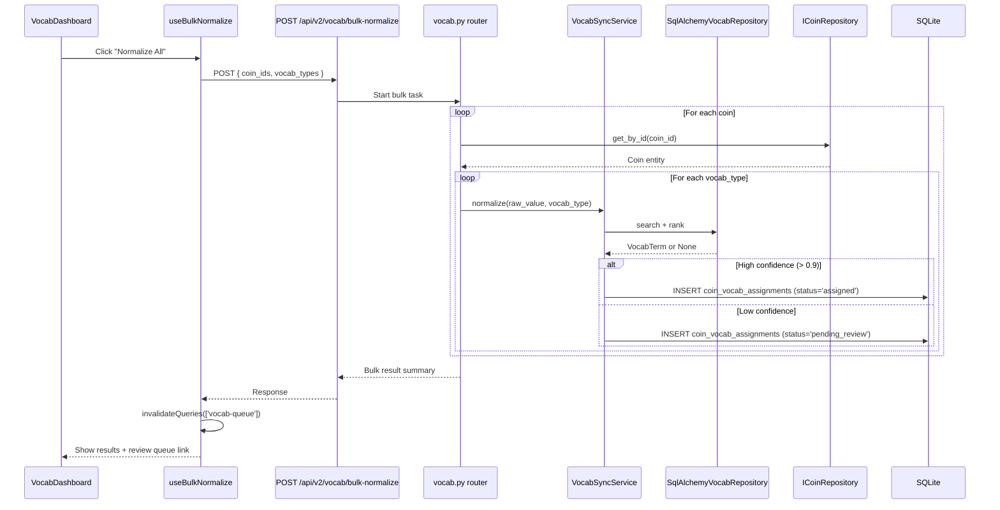
```mermaid
sequenceDiagram
    participant UI as VocabDashboard
    participant Hook as useBulkNormalize
    participant API as POST /api/v2/vocab/bulk-normalize
    participant Router as vocab.py router
    participant Service as VocabSyncService
    participant Repo as SqlAlchemyVocabRepository
    participant CoinRepo as ICoinRepository
    participant DB as SQLite

    UI->>Hook: Click "Normalize All"
    Hook->>API: POST { coin_ids, vocab_types }
    API->>Router: Start bulk task

    loop For each coin
        Router->>CoinRepo: get_by_id(coin_id)
        CoinRepo-->>Router: Coin entity

        loop For each vocab_type
            Router->>Service: normalize(raw_value, vocab_type)
            Service->>Repo: search + rank
            Repo-->>Service: VocabTerm or None

            alt High confidence (> 0.9)
                Service->>DB: INSERT coin_vocab_assignments (status='assigned')
            else Low confidence
                Service->>DB: INSERT coin_vocab_assignments (status='pending_review')
            end
        end
    end

    Router-->>API: Bulk result summary
    API-->>Hook: Response
    Hook->>Hook: invalidateQueries(['vocab-queue'])
    Hook-->>UI: Show results + review queue link
```

---

## Series Flow (V2)

### Create Series with Slots

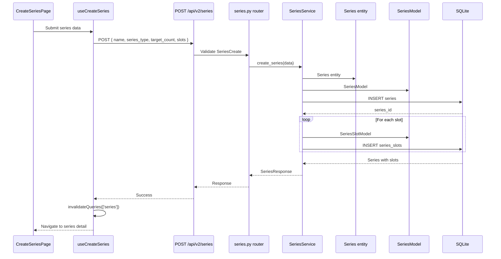
```mermaid
sequenceDiagram
    participant UI as CreateSeriesPage
    participant Hook as useCreateSeries
    participant API as POST /api/v2/series
    participant Router as series.py router
    participant Service as SeriesService
    participant Domain as Series entity
    participant ORM as SeriesModel
    participant DB as SQLite

    UI->>Hook: Submit series data
    Hook->>API: POST { name, series_type, target_count, slots }
    API->>Router: Validate SeriesCreate
    Router->>Service: create_series(data)
    Service->>Domain: Series entity
    Service->>ORM: SeriesModel
    Service->>DB: INSERT series
    DB-->>Service: series_id

    loop For each slot
        Service->>ORM: SeriesSlotModel
        Service->>DB: INSERT series_slots
    end

    DB-->>Service: Series with slots
    Service-->>Router: SeriesResponse
    Router-->>API: Response
    API-->>Hook: Success
    Hook->>Hook: invalidateQueries(['series'])
    Hook-->>UI: Navigate to series detail
```

### Add Coin to Series

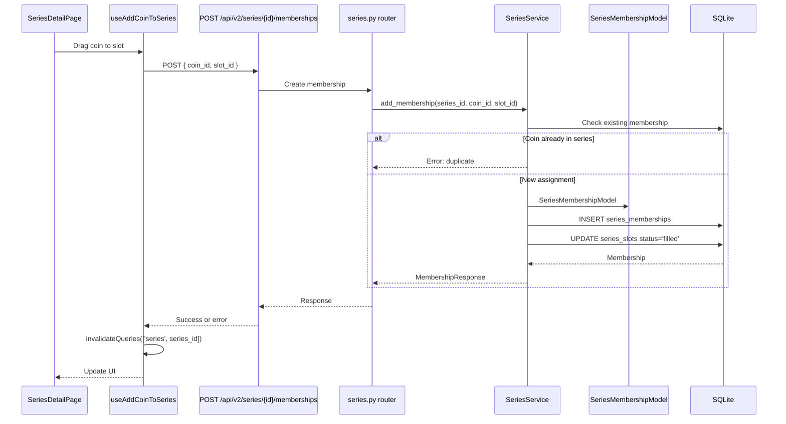
```mermaid
sequenceDiagram
    participant UI as SeriesDetailPage
    participant Hook as useAddCoinToSeries
    participant API as POST /api/v2/series/{id}/memberships
    participant Router as series.py router
    participant Service as SeriesService
    participant ORM as SeriesMembershipModel
    participant DB as SQLite

    UI->>Hook: Drag coin to slot
    Hook->>API: POST { coin_id, slot_id }
    API->>Router: Create membership
    Router->>Service: add_membership(series_id, coin_id, slot_id)
    Service->>DB: Check existing membership

    alt Coin already in series
        Service-->>Router: Error: duplicate
    else New assignment
        Service->>ORM: SeriesMembershipModel
        Service->>DB: INSERT series_memberships
        Service->>DB: UPDATE series_slots status='filled'
        DB-->>Service: Membership
        Service-->>Router: MembershipResponse
    end

    Router-->>API: Response
    API-->>Hook: Success or error
    Hook->>Hook: invalidateQueries(['series', series_id])
    Hook-->>UI: Update UI
```

---

## Audit Flow (V2)

### Run Audit with Strategies

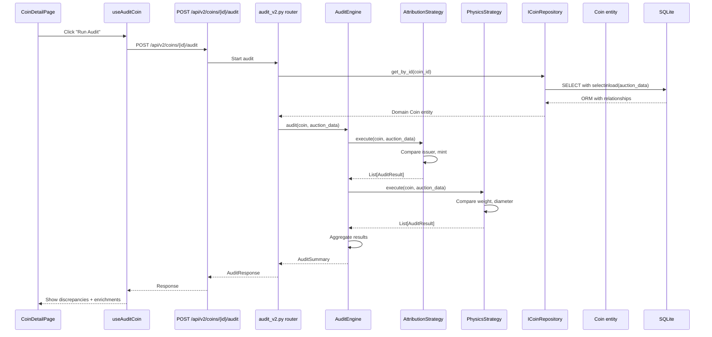
```mermaid
sequenceDiagram
    participant UI as CoinDetailPage
    participant Hook as useAuditCoin
    participant API as POST /api/v2/coins/{id}/audit
    participant Router as audit_v2.py router
    participant Engine as AuditEngine
    participant Strat1 as AttributionStrategy
    participant Strat2 as PhysicsStrategy
    participant Repo as ICoinRepository
    participant Domain as Coin entity
    participant DB as SQLite

    UI->>Hook: Click "Run Audit"
    Hook->>API: POST /api/v2/coins/{id}/audit
    API->>Router: Start audit
    Router->>Repo: get_by_id(coin_id)
    Repo->>DB: SELECT with selectinload(auction_data)
    DB-->>Repo: ORM with relationships
    Repo-->>Router: Domain Coin entity
    Router->>Engine: audit(coin, auction_data)

    Engine->>Strat1: execute(coin, auction_data)
    Strat1->>Strat1: Compare issuer, mint
    Strat1-->>Engine: List[AuditResult]

    Engine->>Strat2: execute(coin, auction_data)
    Strat2->>Strat2: Compare weight, diameter
    Strat2-->>Engine: List[AuditResult]

    Engine->>Engine: Aggregate results
    Engine-->>Router: AuditSummary
    Router-->>API: AuditResponse
    API-->>Hook: Response
    Hook-->>UI: Show discrepancies + enrichments
```

---

## Scraper Flow (V2)

### Scrape Auction Lot (Playwright)

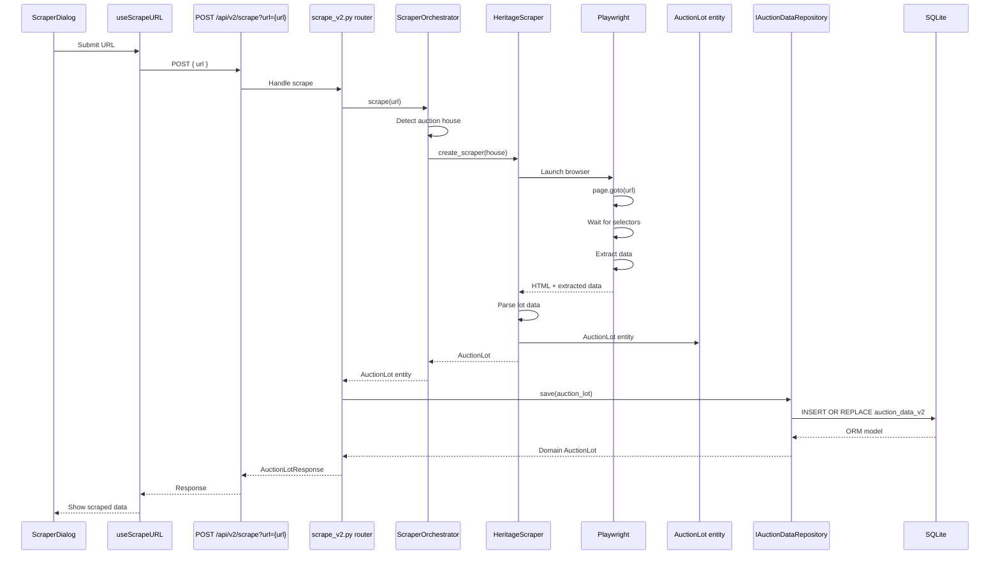
```mermaid
sequenceDiagram
    participant UI as ScraperDialog
    participant Hook as useScrapeURL
    participant API as POST /api/v2/scrape?url={url}
    participant Router as scrape_v2.py router
    participant Orch as ScraperOrchestrator
    participant Scraper as HeritageScraper
    participant Browser as Playwright
    participant Domain as AuctionLot entity
    participant Repo as IAuctionDataRepository
    participant DB as SQLite

    UI->>Hook: Submit URL
    Hook->>API: POST { url }
    API->>Router: Handle scrape
    Router->>Orch: scrape(url)
    Orch->>Orch: Detect auction house
    Orch->>Scraper: create_scraper(house)

    Scraper->>Browser: Launch browser
    Browser->>Browser: page.goto(url)
    Browser->>Browser: Wait for selectors
    Browser->>Browser: Extract data
    Browser-->>Scraper: HTML + extracted data
    Scraper->>Scraper: Parse lot data
    Scraper->>Domain: AuctionLot entity
    Scraper-->>Orch: AuctionLot
    Orch-->>Router: AuctionLot entity

    Router->>Repo: save(auction_lot)
    Repo->>DB: INSERT OR REPLACE auction_data_v2
    DB-->>Repo: ORM model
    Repo-->>Router: Domain AuctionLot
    Router-->>API: AuctionLotResponse
    API-->>Hook: Response
    Hook-->>UI: Show scraped data
```

---

## Frontend State Flow (V2)

### TanStack Query + Zustand Pattern

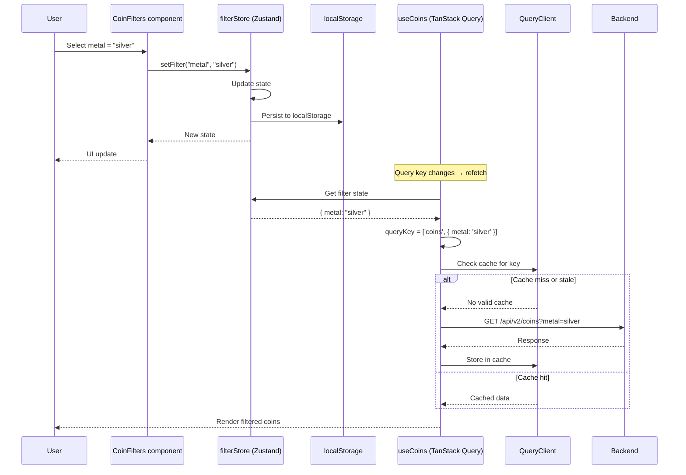
```mermaid
sequenceDiagram
    participant User
    participant Filter as CoinFilters component
    participant Store as filterStore (Zustand)
    participant Storage as localStorage
    participant Hook as useCoins (TanStack Query)
    participant Cache as QueryClient
    participant API as Backend

    User->>Filter: Select metal = "silver"
    Filter->>Store: setFilter("metal", "silver")
    Store->>Store: Update state
    Store->>Storage: Persist to localStorage
    Store-->>Filter: New state
    Filter-->>User: UI update

    Note over Hook: Query key changes → refetch

    Hook->>Store: Get filter state
    Store-->>Hook: { metal: "silver" }
    Hook->>Hook: queryKey = ['coins', { metal: 'silver' }]
    Hook->>Cache: Check cache for key

    alt Cache miss or stale
        Cache-->>Hook: No valid cache
        Hook->>API: GET /api/v2/coins?metal=silver
        API-->>Hook: Response
        Hook->>Cache: Store in cache
    else Cache hit
        Cache-->>Hook: Cached data
    end

    Hook-->>User: Render filtered coins
```

### Query Invalidation on Mutation

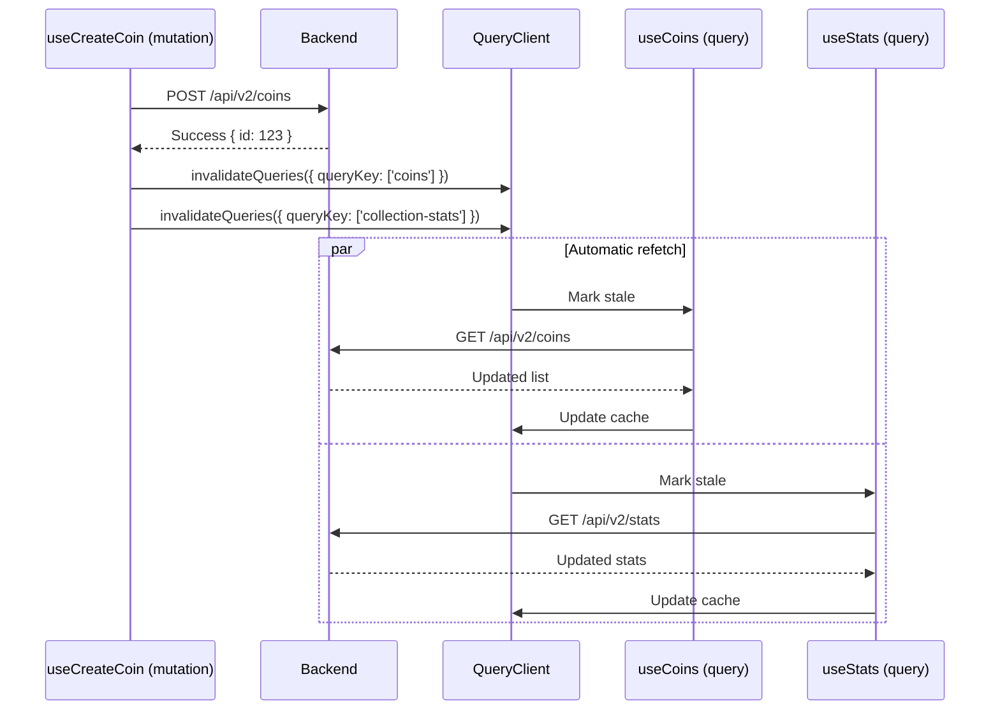
```mermaid
sequenceDiagram
    participant Mutation as useCreateCoin (mutation)
    participant API as Backend
    participant Cache as QueryClient
    participant Query1 as useCoins (query)
    participant Query2 as useStats (query)

    Mutation->>API: POST /api/v2/coins
    API-->>Mutation: Success { id: 123 }

    Mutation->>Cache: invalidateQueries({ queryKey: ['coins'] })
    Mutation->>Cache: invalidateQueries({ queryKey: ['collection-stats'] })

    par Automatic refetch
        Cache->>Query1: Mark stale
        Query1->>API: GET /api/v2/coins
        API-->>Query1: Updated list
        Query1->>Cache: Update cache
        and
        Cache->>Query2: Mark stale
        Query2->>API: GET /api/v2/stats
        API-->>Query2: Updated stats
        Query2->>Cache: Update cache
    end
```

---

## Import Flow (V2)

### Excel Import with Use Case

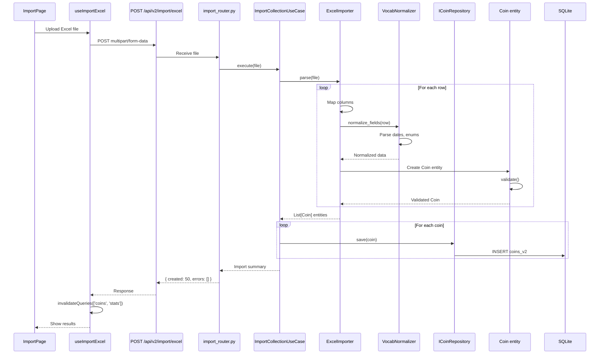
```mermaid
sequenceDiagram
    participant UI as ImportPage
    participant Hook as useImportExcel
    participant API as POST /api/v2/import/excel
    participant Router as import_router.py
    participant UseCase as ImportCollectionUseCase
    participant Importer as ExcelImporter
    participant Normalizer as VocabNormalizer
    participant Repo as ICoinRepository
    participant Domain as Coin entity
    participant DB as SQLite

    UI->>Hook: Upload Excel file
    Hook->>API: POST multipart/form-data
    API->>Router: Receive file
    Router->>UseCase: execute(file)
    UseCase->>Importer: parse(file)

    loop For each row
        Importer->>Importer: Map columns
        Importer->>Normalizer: normalize_fields(row)
        Normalizer->>Normalizer: Parse dates, enums
        Normalizer-->>Importer: Normalized data
        Importer->>Domain: Create Coin entity
        Domain->>Domain: validate()
        Domain-->>Importer: Validated Coin
    end

    Importer-->>UseCase: List[Coin] entities

    loop For each coin
        UseCase->>Repo: save(coin)
        Repo->>DB: INSERT coins_v2
    end

    UseCase-->>Router: Import summary
    Router-->>API: { created: 50, errors: [] }
    API-->>Hook: Response
    Hook->>Hook: invalidateQueries(['coins', 'stats'])
    Hook-->>UI: Show results
```

---

## LLM Enrichment Flow (V2)

### Generate Description with LLM

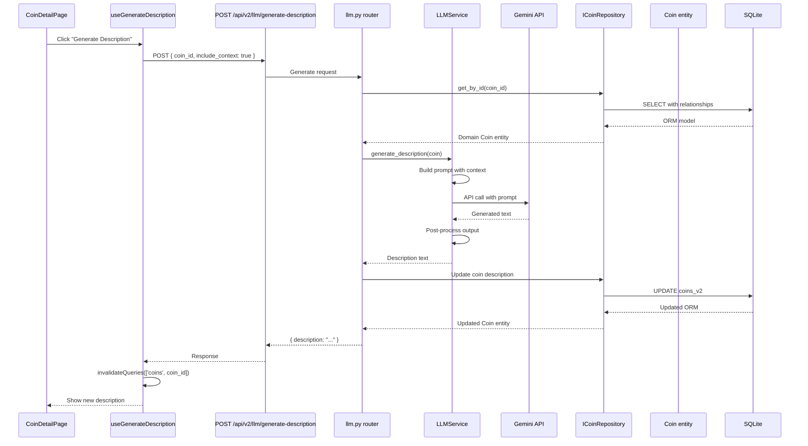
```mermaid
sequenceDiagram
    participant UI as CoinDetailPage
    participant Hook as useGenerateDescription
    participant API as POST /api/v2/llm/generate-description
    participant Router as llm.py router
    participant Service as LLMService
    participant LLM as Gemini API
    participant Repo as ICoinRepository
    participant Domain as Coin entity
    participant DB as SQLite

    UI->>Hook: Click "Generate Description"
    Hook->>API: POST { coin_id, include_context: true }
    API->>Router: Generate request
    Router->>Repo: get_by_id(coin_id)
    Repo->>DB: SELECT with relationships
    DB-->>Repo: ORM model
    Repo-->>Router: Domain Coin entity

    Router->>Service: generate_description(coin)
    Service->>Service: Build prompt with context
    Service->>LLM: API call with prompt
    LLM-->>Service: Generated text
    Service->>Service: Post-process output
    Service-->>Router: Description text

    Router->>Repo: Update coin description
    Repo->>DB: UPDATE coins_v2
    DB-->>Repo: Updated ORM
    Repo-->>Router: Updated Coin entity
    Router-->>API: { description: "..." }
    API-->>Hook: Response
    Hook->>Hook: invalidateQueries(['coins', coin_id])
    Hook-->>UI: Show new description
```

---

## Transaction Management (V2)

### Automatic Transaction Handling

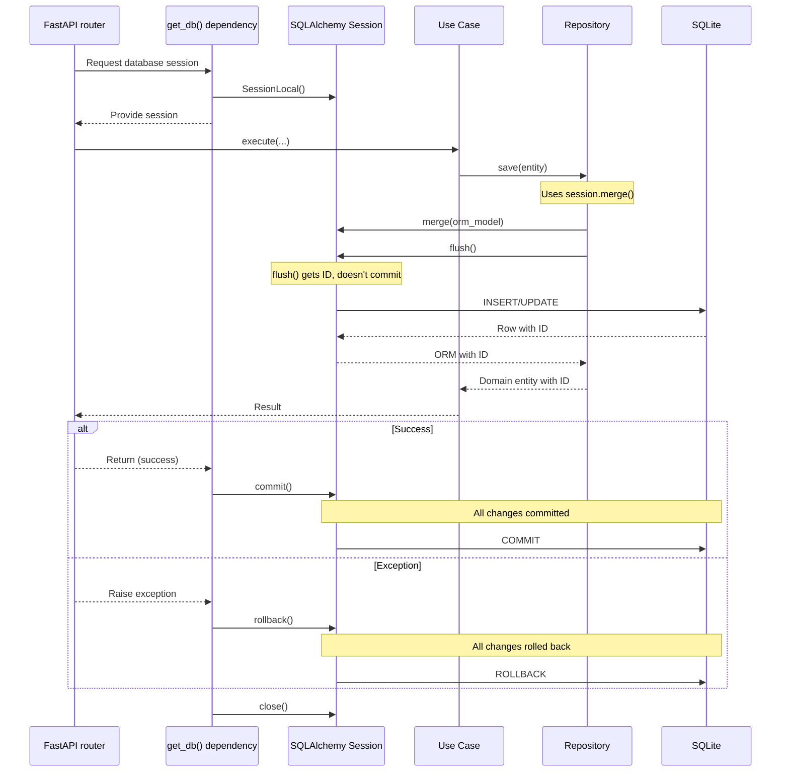
```mermaid
sequenceDiagram
    participant Router as FastAPI router
    participant Dep as get_db() dependency
    participant Session as SQLAlchemy Session
    participant UseCase as Use Case
    participant Repo as Repository
    participant DB as SQLite

    Router->>Dep: Request database session
    Dep->>Session: SessionLocal()
    Dep-->>Router: Provide session

    Router->>UseCase: execute(...)
    UseCase->>Repo: save(entity)
    Note over Repo: Uses session.merge()
    Repo->>Session: merge(orm_model)
    Repo->>Session: flush()
    Note over Session: flush() gets ID, doesn't commit
    Session->>DB: INSERT/UPDATE
    DB-->>Session: Row with ID
    Session-->>Repo: ORM with ID
    Repo-->>UseCase: Domain entity with ID
    UseCase-->>Router: Result

    alt Success
        Router-->>Dep: Return (success)
        Dep->>Session: commit()
        Note over Session,DB: All changes committed
        Session->>DB: COMMIT
    else Exception
        Router-->>Dep: Raise exception
        Dep->>Session: rollback()
        Note over Session,DB: All changes rolled back
        Session->>DB: ROLLBACK
    end

    Dep->>Session: close()
```

---

## Error Handling Flow (V2)

### Backend Validation Error

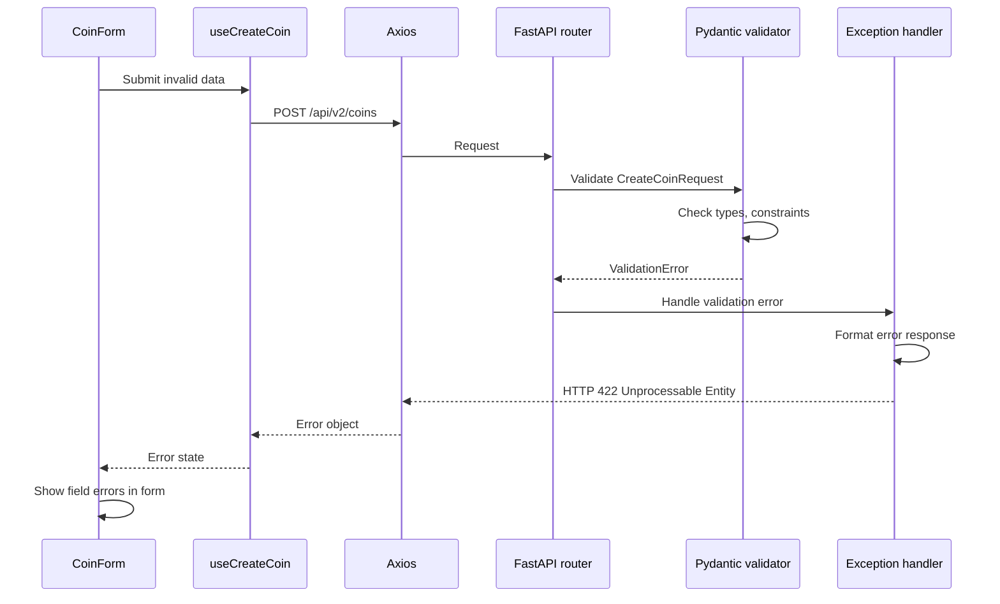
```mermaid
sequenceDiagram
    participant UI as CoinForm
    participant Hook as useCreateCoin
    participant API as Axios
    participant Router as FastAPI router
    participant Pydantic as Pydantic validator
    participant Handler as Exception handler

    UI->>Hook: Submit invalid data
    Hook->>API: POST /api/v2/coins
    API->>Router: Request
    Router->>Pydantic: Validate CreateCoinRequest
    Pydantic->>Pydantic: Check types, constraints
    Pydantic-->>Router: ValidationError
    Router->>Handler: Handle validation error
    Handler->>Handler: Format error response
    Handler-->>API: HTTP 422 Unprocessable Entity
    API-->>Hook: Error object
    Hook-->>UI: Error state
    UI->>UI: Show field errors in form
```

### Domain Validation Error

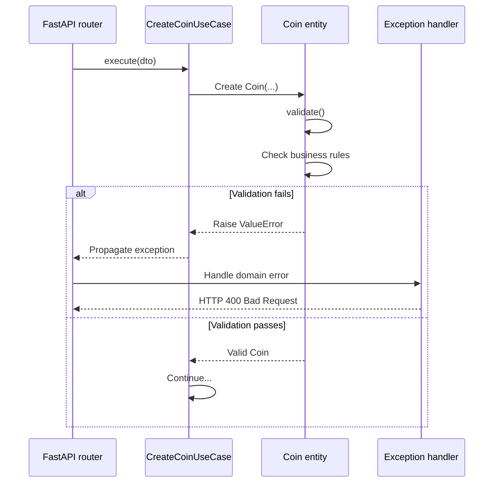
```mermaid
sequenceDiagram
    participant Router as FastAPI router
    participant UseCase as CreateCoinUseCase
    participant Domain as Coin entity
    participant Handler as Exception handler

    Router->>UseCase: execute(dto)
    UseCase->>Domain: Create Coin(...)
    Domain->>Domain: validate()
    Domain->>Domain: Check business rules

    alt Validation fails
        Domain-->>UseCase: Raise ValueError
        UseCase-->>Router: Propagate exception
        Router->>Handler: Handle domain error
        Handler-->>Router: HTTP 400 Bad Request
    else Validation passes
        Domain-->>UseCase: Valid Coin
        UseCase->>UseCase: Continue...
    end
```

---

## Performance Optimization

### N+1 Prevention with Eager Loading

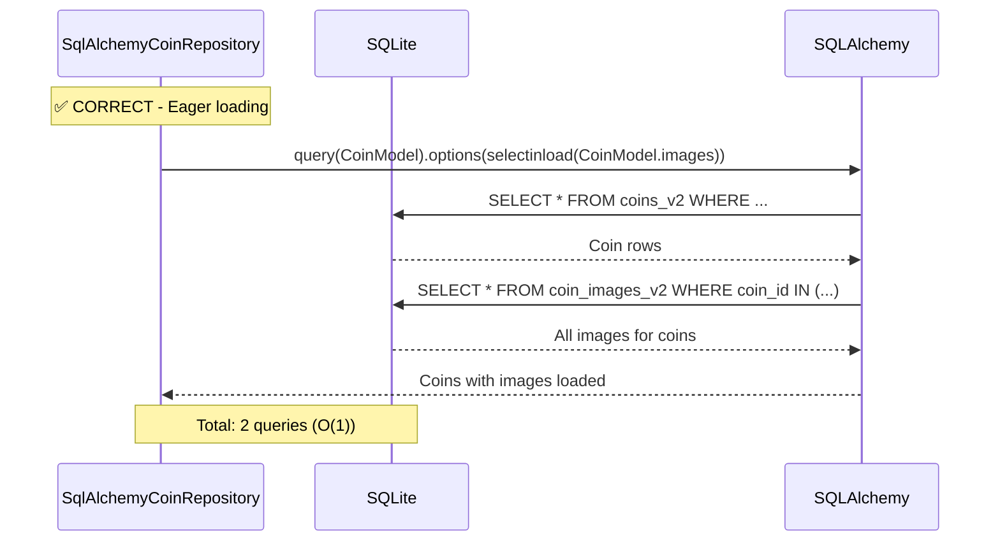
```mermaid
sequenceDiagram
    participant Repo as SqlAlchemyCoinRepository
    participant DB as SQLite
    participant ORM as SQLAlchemy

    Note over Repo: ✅ CORRECT - Eager loading

    Repo->>ORM: query(CoinModel).options(selectinload(CoinModel.images))
    ORM->>DB: SELECT * FROM coins_v2 WHERE ...
    DB-->>ORM: Coin rows
    ORM->>DB: SELECT * FROM coin_images_v2 WHERE coin_id IN (...)
    DB-->>ORM: All images for coins
    ORM-->>Repo: Coins with images loaded

    Note over Repo,DB: Total: 2 queries (O(1))
```

**Wrong Pattern (causes N+1)**:

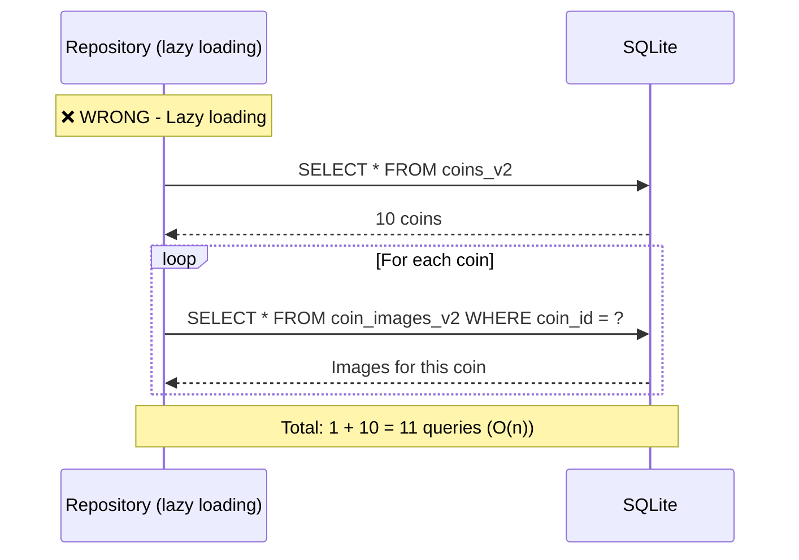
```mermaid
sequenceDiagram
    participant Repo as Repository (lazy loading)
    participant DB as SQLite

    Note over Repo: ❌ WRONG - Lazy loading

    Repo->>DB: SELECT * FROM coins_v2
    DB-->>Repo: 10 coins

    loop For each coin
        Repo->>DB: SELECT * FROM coin_images_v2 WHERE coin_id = ?
        DB-->>Repo: Images for this coin
    end

    Note over Repo,DB: Total: 1 + 10 = 11 queries (O(n))
```

---

## Key V2 Patterns Summary

### Clean Architecture Flow
1. **Router** validates Pydantic schemas
2. **Use Case** orchestrates domain logic via interfaces
3. **Repository** (Protocol) defines contract
4. **Repository Impl** converts ORM ↔ Domain
5. **Domain Entity** contains business logic
6. **get_db()** manages transactions

### State Management
- **TanStack Query**: Server state (coins, series, vocab)
- **Zustand**: Client state (UI, filters)
- **localStorage**: Filter persistence

### Transaction Safety
- Repositories use `flush()` NOT `commit()`
- `get_db()` commits on success, rolls back on error
- Multiple repository calls = one transaction

### N+1 Prevention
- Always use `selectinload()` for relationships
- Repository methods eager load by default

---

## Critical Rules

### Port Configuration (MANDATORY)
- Backend: Port 8000
- Frontend: Port 3000
- Never increment ports

### Database Safety (MANDATORY)
- Backup required before schema changes
- Format: `coinstack_YYYYMMDD_HHMMSS.db`

### Architecture Rules (MANDATORY)
- Domain entities have NO dependencies
- Use cases depend on interfaces (Protocols)
- Repositories use `flush()` NOT `commit()`
- Always use `selectinload()` for relationships
- `get_db()` manages transactions automatically

---

**Previous:** [05-DATA-MODEL.md](05-DATA-MODEL.md) - Database schema
**Next:** [07-API-REFERENCE.md](07-API-REFERENCE.md) - API endpoints
