# Data Flows

## Coin CRUD Flow

### Create Coin

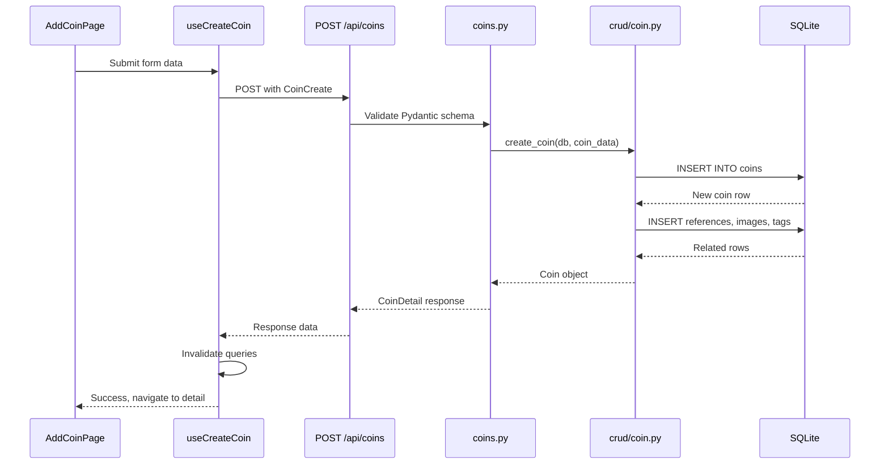
```mermaid
sequenceDiagram
    participant UI as AddCoinPage
    participant Hook as useCreateCoin
    participant API as POST /api/coins
    participant Router as coins.py
    participant CRUD as crud/coin.py
    participant DB as SQLite

    UI->>Hook: Submit form data
    Hook->>API: POST with CoinCreate
    API->>Router: Validate Pydantic schema
    Router->>CRUD: create_coin(db, coin_data)
    CRUD->>DB: INSERT INTO coins
    DB-->>CRUD: New coin row
    CRUD->>DB: INSERT references, images, tags
    DB-->>CRUD: Related rows
    CRUD-->>Router: Coin object
    Router-->>API: CoinDetail response
    API-->>Hook: Response data
    Hook->>Hook: Invalidate queries
    Hook-->>UI: Success, navigate to detail
```

### Update Coin

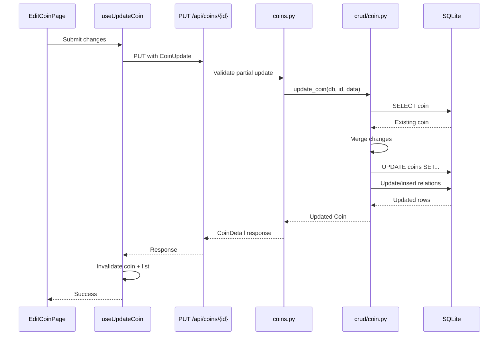
```mermaid
sequenceDiagram
    participant UI as EditCoinPage
    participant Hook as useUpdateCoin
    participant API as PUT /api/coins/{id}
    participant Router as coins.py
    participant CRUD as crud/coin.py
    participant DB as SQLite

    UI->>Hook: Submit changes
    Hook->>API: PUT with CoinUpdate
    API->>Router: Validate partial update
    Router->>CRUD: update_coin(db, id, data)
    CRUD->>DB: SELECT coin
    DB-->>CRUD: Existing coin
    CRUD->>CRUD: Merge changes
    CRUD->>DB: UPDATE coins SET...
    CRUD->>DB: Update/insert relations
    DB-->>CRUD: Updated rows
    CRUD-->>Router: Updated Coin
    Router-->>API: CoinDetail response
    API-->>Hook: Response
    Hook->>Hook: Invalidate coin + list
    Hook-->>UI: Success
```

### List Coins with Filters

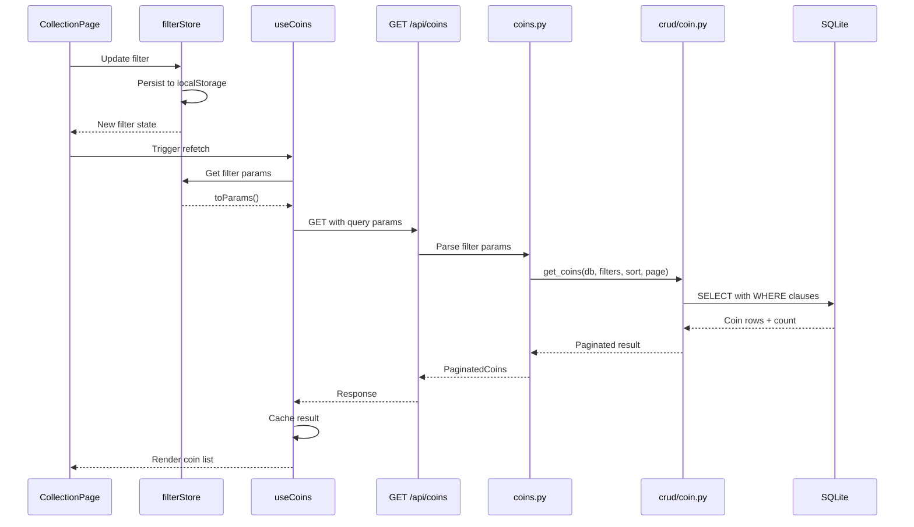
```mermaid
sequenceDiagram
    participant UI as CollectionPage
    participant Store as filterStore
    participant Hook as useCoins
    participant API as GET /api/coins
    participant Router as coins.py
    participant CRUD as crud/coin.py
    participant DB as SQLite

    UI->>Store: Update filter
    Store->>Store: Persist to localStorage
    Store-->>UI: New filter state
    UI->>Hook: Trigger refetch
    Hook->>Store: Get filter params
    Store-->>Hook: toParams()
    Hook->>API: GET with query params
    API->>Router: Parse filter params
    Router->>CRUD: get_coins(db, filters, sort, page)
    CRUD->>DB: SELECT with WHERE clauses
    DB-->>CRUD: Coin rows + count
    CRUD-->>Router: Paginated result
    Router-->>API: PaginatedCoins
    API-->>Hook: Response
    Hook->>Hook: Cache result
    Hook-->>UI: Render coin list
```

---

## Import Flow

### Import from URL

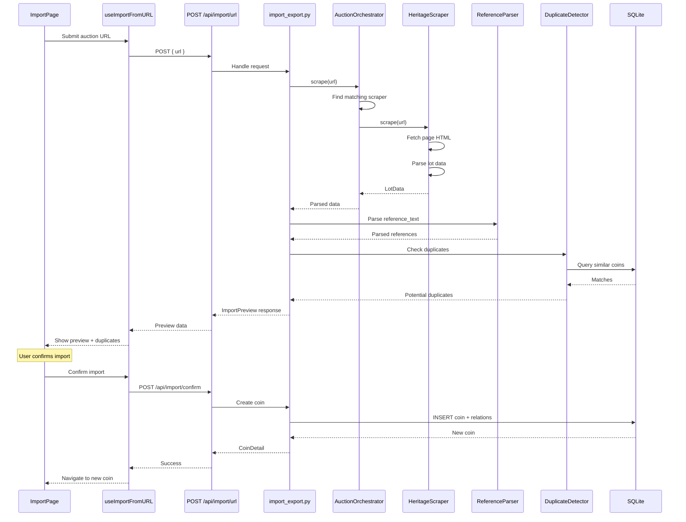
```mermaid
sequenceDiagram
    participant UI as ImportPage
    participant Hook as useImportFromURL
    participant API as POST /api/import/url
    participant Router as import_export.py
    participant Orch as AuctionOrchestrator
    participant Scraper as HeritageScraper
    participant Parser as ReferenceParser
    participant Dup as DuplicateDetector
    participant DB as SQLite

    UI->>Hook: Submit auction URL
    Hook->>API: POST { url }
    API->>Router: Handle request
    Router->>Orch: scrape(url)
    Orch->>Orch: Find matching scraper
    Orch->>Scraper: scrape(url)
    Scraper->>Scraper: Fetch page HTML
    Scraper->>Scraper: Parse lot data
    Scraper-->>Orch: LotData
    Orch-->>Router: Parsed data
    Router->>Parser: Parse reference_text
    Parser-->>Router: Parsed references
    Router->>Dup: Check duplicates
    Dup->>DB: Query similar coins
    DB-->>Dup: Matches
    Dup-->>Router: Potential duplicates
    Router-->>API: ImportPreview response
    API-->>Hook: Preview data
    Hook-->>UI: Show preview + duplicates
    
    Note over UI: User confirms import
    
    UI->>Hook: Confirm import
    Hook->>API: POST /api/import/confirm
    API->>Router: Create coin
    Router->>DB: INSERT coin + relations
    DB-->>Router: New coin
    Router-->>API: CoinDetail
    API-->>Hook: Success
    Hook-->>UI: Navigate to new coin
```

### Excel Import

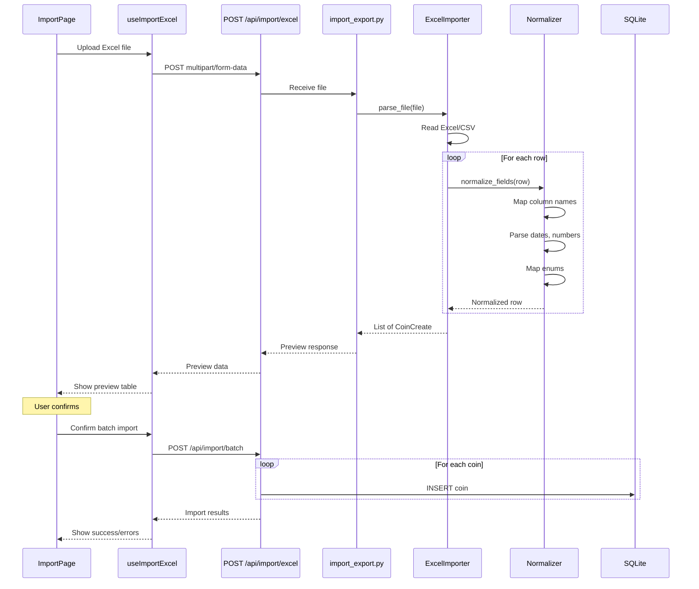
```mermaid
sequenceDiagram
    participant UI as ImportPage
    participant Hook as useImportExcel
    participant API as POST /api/import/excel
    participant Router as import_export.py
    participant Importer as ExcelImporter
    participant Norm as Normalizer
    participant DB as SQLite

    UI->>Hook: Upload Excel file
    Hook->>API: POST multipart/form-data
    API->>Router: Receive file
    Router->>Importer: parse_file(file)
    Importer->>Importer: Read Excel/CSV
    loop For each row
        Importer->>Norm: normalize_fields(row)
        Norm->>Norm: Map column names
        Norm->>Norm: Parse dates, numbers
        Norm->>Norm: Map enums
        Norm-->>Importer: Normalized row
    end
    Importer-->>Router: List of CoinCreate
    Router-->>API: Preview response
    API-->>Hook: Preview data
    Hook-->>UI: Show preview table
    
    Note over UI: User confirms
    
    UI->>Hook: Confirm batch import
    Hook->>API: POST /api/import/batch
    loop For each coin
        API->>DB: INSERT coin
    end
    API-->>Hook: Import results
    Hook-->>UI: Show success/errors
```

---

## Audit Flow

### Start Audit

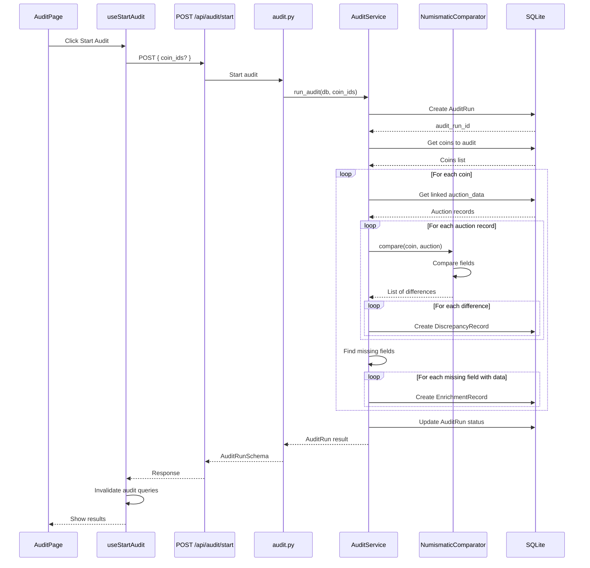
```mermaid
sequenceDiagram
    participant UI as AuditPage
    participant Hook as useStartAudit
    participant API as POST /api/audit/start
    participant Router as audit.py
    participant Service as AuditService
    participant Comp as NumismaticComparator
    participant DB as SQLite

    UI->>Hook: Click Start Audit
    Hook->>API: POST { coin_ids? }
    API->>Router: Start audit
    Router->>Service: run_audit(db, coin_ids)
    Service->>DB: Create AuditRun
    DB-->>Service: audit_run_id
    Service->>DB: Get coins to audit
    DB-->>Service: Coins list
    
    loop For each coin
        Service->>DB: Get linked auction_data
        DB-->>Service: Auction records
        loop For each auction record
            Service->>Comp: compare(coin, auction)
            Comp->>Comp: Compare fields
            Comp-->>Service: List of differences
            loop For each difference
                Service->>DB: Create DiscrepancyRecord
            end
        end
        Service->>Service: Find missing fields
        loop For each missing field with data
            Service->>DB: Create EnrichmentRecord
        end
    end
    
    Service->>DB: Update AuditRun status
    Service-->>Router: AuditRun result
    Router-->>API: AuditRunSchema
    API-->>Hook: Response
    Hook->>Hook: Invalidate audit queries
    Hook-->>UI: Show results
```

### Resolve Discrepancy

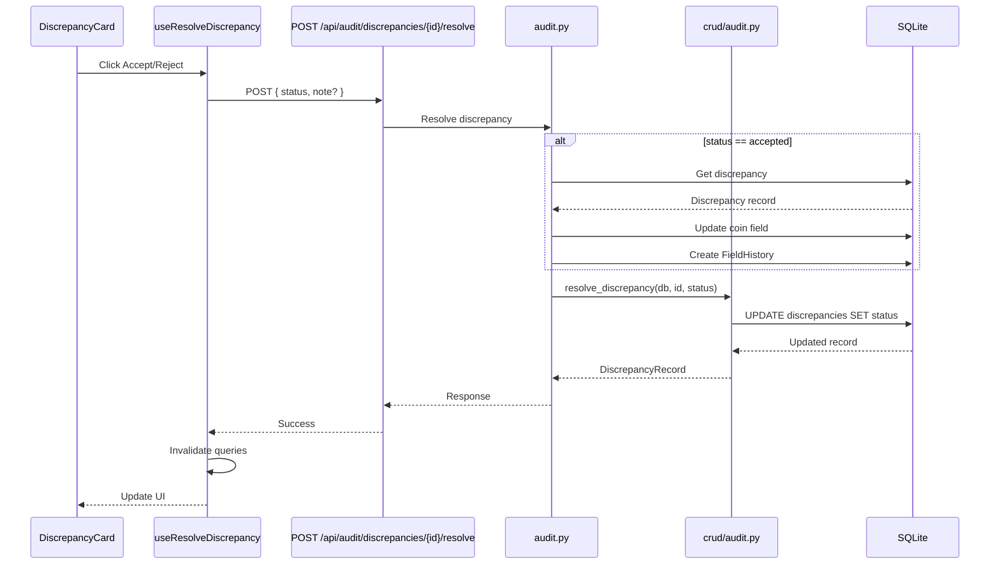
```mermaid
sequenceDiagram
    participant UI as DiscrepancyCard
    participant Hook as useResolveDiscrepancy
    participant API as POST /api/audit/discrepancies/{id}/resolve
    participant Router as audit.py
    participant CRUD as crud/audit.py
    participant DB as SQLite

    UI->>Hook: Click Accept/Reject
    Hook->>API: POST { status, note? }
    API->>Router: Resolve discrepancy
    
    alt status == accepted
        Router->>DB: Get discrepancy
        DB-->>Router: Discrepancy record
        Router->>DB: Update coin field
        Router->>DB: Create FieldHistory
    end
    
    Router->>CRUD: resolve_discrepancy(db, id, status)
    CRUD->>DB: UPDATE discrepancies SET status
    DB-->>CRUD: Updated record
    CRUD-->>Router: DiscrepancyRecord
    Router-->>API: Response
    API-->>Hook: Success
    Hook->>Hook: Invalidate queries
    Hook-->>UI: Update UI
```

### Auto-Merge

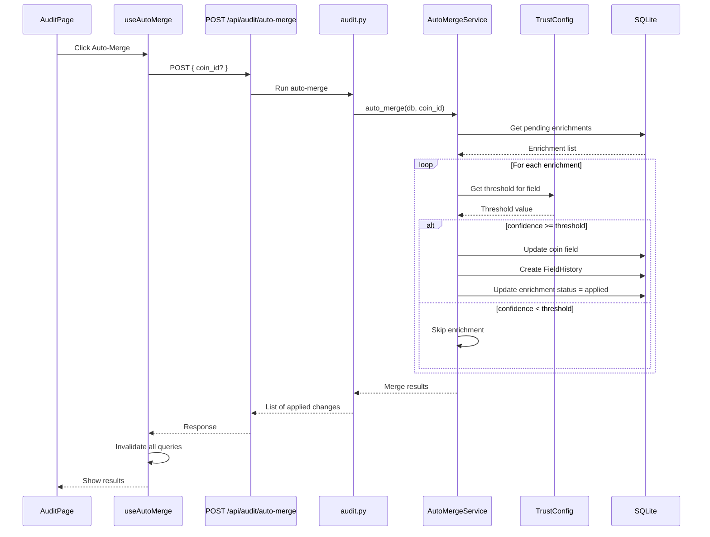
```mermaid
sequenceDiagram
    participant UI as AuditPage
    participant Hook as useAutoMerge
    participant API as POST /api/audit/auto-merge
    participant Router as audit.py
    participant Service as AutoMergeService
    participant Trust as TrustConfig
    participant DB as SQLite

    UI->>Hook: Click Auto-Merge
    Hook->>API: POST { coin_id? }
    API->>Router: Run auto-merge
    Router->>Service: auto_merge(db, coin_id)
    Service->>DB: Get pending enrichments
    DB-->>Service: Enrichment list
    
    loop For each enrichment
        Service->>Trust: Get threshold for field
        Trust-->>Service: Threshold value
        alt confidence >= threshold
            Service->>DB: Update coin field
            Service->>DB: Create FieldHistory
            Service->>DB: Update enrichment status = applied
        else confidence < threshold
            Service->>Service: Skip enrichment
        end
    end
    
    Service-->>Router: Merge results
    Router-->>API: List of applied changes
    API-->>Hook: Response
    Hook->>Hook: Invalidate all queries
    Hook-->>UI: Show results
```

---

## Scraping Flow

### Single URL Scrape

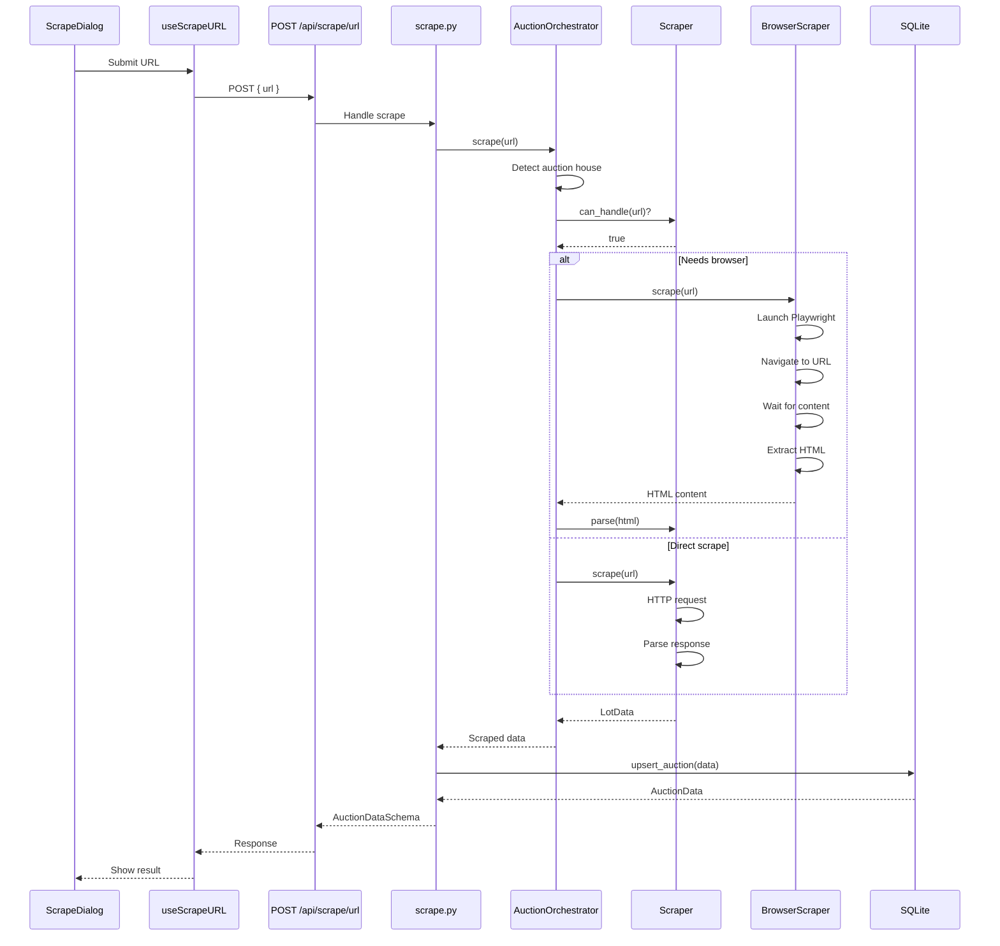
```mermaid
sequenceDiagram
    participant UI as ScrapeDialog
    participant Hook as useScrapeURL
    participant API as POST /api/scrape/url
    participant Router as scrape.py
    participant Orch as AuctionOrchestrator
    participant Scraper as Scraper
    participant Browser as BrowserScraper
    participant DB as SQLite

    UI->>Hook: Submit URL
    Hook->>API: POST { url }
    API->>Router: Handle scrape
    Router->>Orch: scrape(url)
    Orch->>Orch: Detect auction house
    Orch->>Scraper: can_handle(url)?
    Scraper-->>Orch: true
    
    alt Needs browser
        Orch->>Browser: scrape(url)
        Browser->>Browser: Launch Playwright
        Browser->>Browser: Navigate to URL
        Browser->>Browser: Wait for content
        Browser->>Browser: Extract HTML
        Browser-->>Orch: HTML content
        Orch->>Scraper: parse(html)
    else Direct scrape
        Orch->>Scraper: scrape(url)
        Scraper->>Scraper: HTTP request
        Scraper->>Scraper: Parse response
    end
    
    Scraper-->>Orch: LotData
    Orch-->>Router: Scraped data
    Router->>DB: upsert_auction(data)
    DB-->>Router: AuctionData
    Router-->>API: AuctionDataSchema
    API-->>Hook: Response
    Hook-->>UI: Show result
```

### Batch Scrape (Background Job)

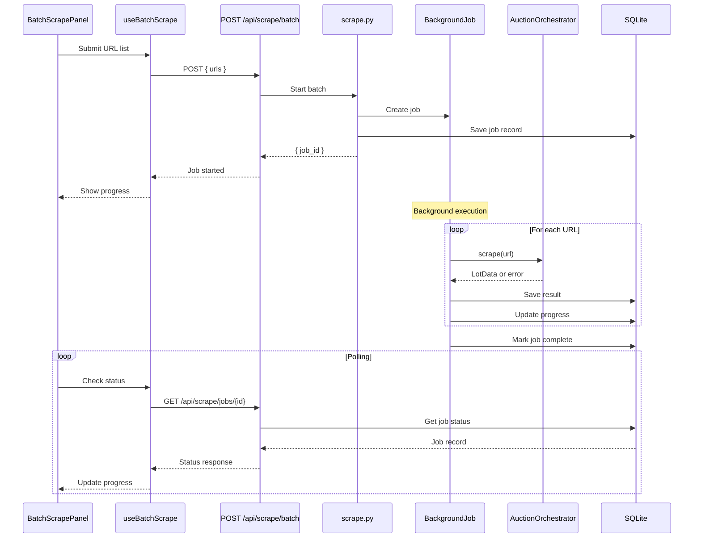
```mermaid
sequenceDiagram
    participant UI as BatchScrapePanel
    participant Hook as useBatchScrape
    participant API as POST /api/scrape/batch
    participant Router as scrape.py
    participant Job as BackgroundJob
    participant Orch as AuctionOrchestrator
    participant DB as SQLite

    UI->>Hook: Submit URL list
    Hook->>API: POST { urls }
    API->>Router: Start batch
    Router->>Job: Create job
    Router->>DB: Save job record
    Router-->>API: { job_id }
    API-->>Hook: Job started
    Hook-->>UI: Show progress

    Note over Job: Background execution
    
    loop For each URL
        Job->>Orch: scrape(url)
        Orch-->>Job: LotData or error
        Job->>DB: Save result
        Job->>DB: Update progress
    end
    Job->>DB: Mark job complete

    loop Polling
        UI->>Hook: Check status
        Hook->>API: GET /api/scrape/jobs/{id}
        API->>DB: Get job status
        DB-->>API: Job record
        API-->>Hook: Status response
        Hook-->>UI: Update progress
    end
```

---

## Catalog Enrichment Flow

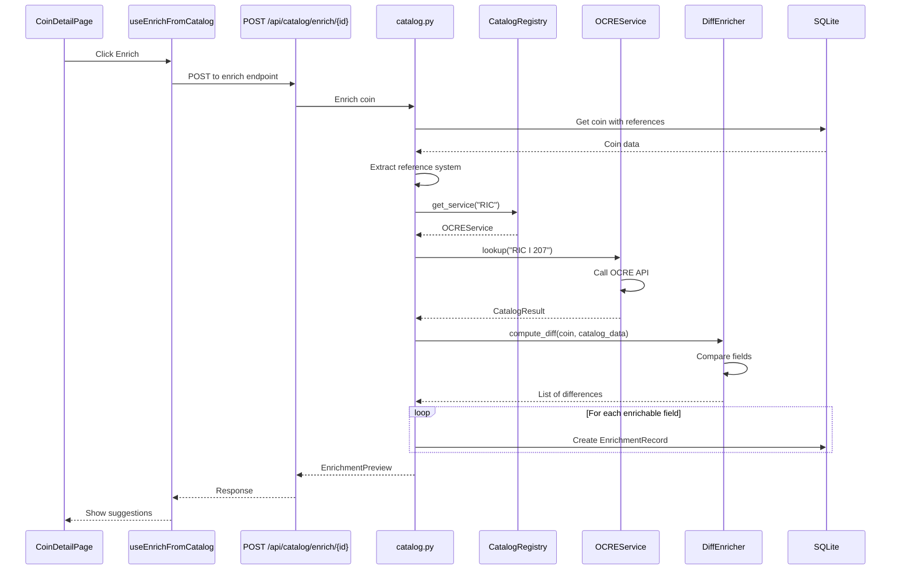
```mermaid
sequenceDiagram
    participant UI as CoinDetailPage
    participant Hook as useEnrichFromCatalog
    participant API as POST /api/catalog/enrich/{id}
    participant Router as catalog.py
    participant Reg as CatalogRegistry
    participant Cat as OCREService
    participant Diff as DiffEnricher
    participant DB as SQLite

    UI->>Hook: Click Enrich
    Hook->>API: POST to enrich endpoint
    API->>Router: Enrich coin
    Router->>DB: Get coin with references
    DB-->>Router: Coin data
    Router->>Router: Extract reference system
    Router->>Reg: get_service("RIC")
    Reg-->>Router: OCREService
    Router->>Cat: lookup("RIC I 207")
    Cat->>Cat: Call OCRE API
    Cat-->>Router: CatalogResult
    Router->>Diff: compute_diff(coin, catalog_data)
    Diff->>Diff: Compare fields
    Diff-->>Router: List of differences
    
    loop For each enrichable field
        Router->>DB: Create EnrichmentRecord
    end
    
    Router-->>API: EnrichmentPreview
    API-->>Hook: Response
    Hook-->>UI: Show suggestions
```

---

## Frontend State Flow

### Filter State Management

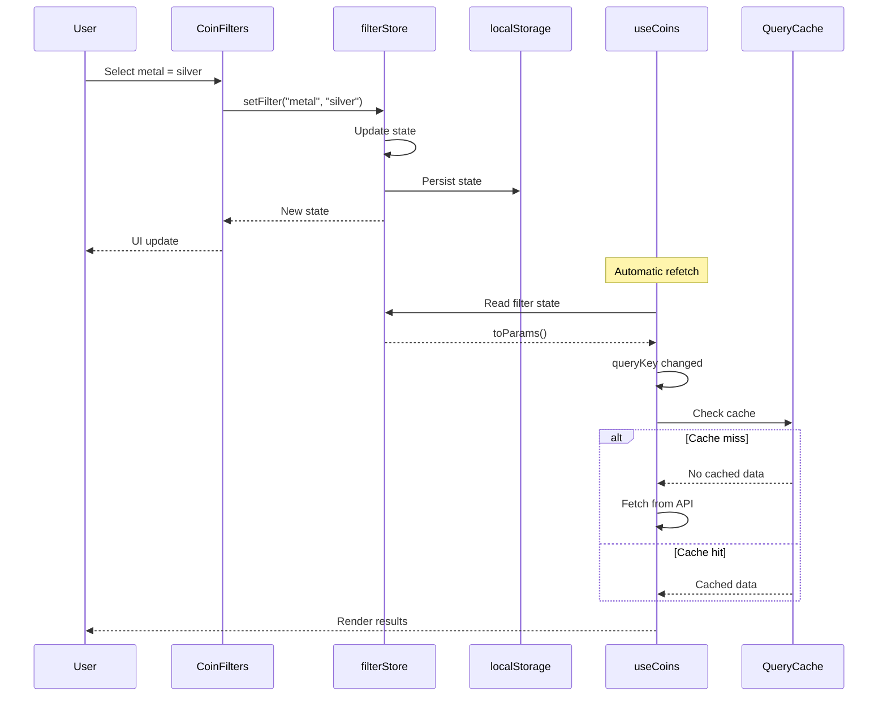
```mermaid
sequenceDiagram
    participant User
    participant Filter as CoinFilters
    participant Store as filterStore
    participant Storage as localStorage
    participant Hook as useCoins
    participant Cache as QueryCache

    User->>Filter: Select metal = silver
    Filter->>Store: setFilter("metal", "silver")
    Store->>Store: Update state
    Store->>Storage: Persist state
    Store-->>Filter: New state
    Filter-->>User: UI update
    
    Note over Hook: Automatic refetch
    
    Hook->>Store: Read filter state
    Store-->>Hook: toParams()
    Hook->>Hook: queryKey changed
    Hook->>Cache: Check cache
    
    alt Cache miss
        Cache-->>Hook: No cached data
        Hook->>Hook: Fetch from API
    else Cache hit
        Cache-->>Hook: Cached data
    end
    
    Hook-->>User: Render results
```

### Query Invalidation

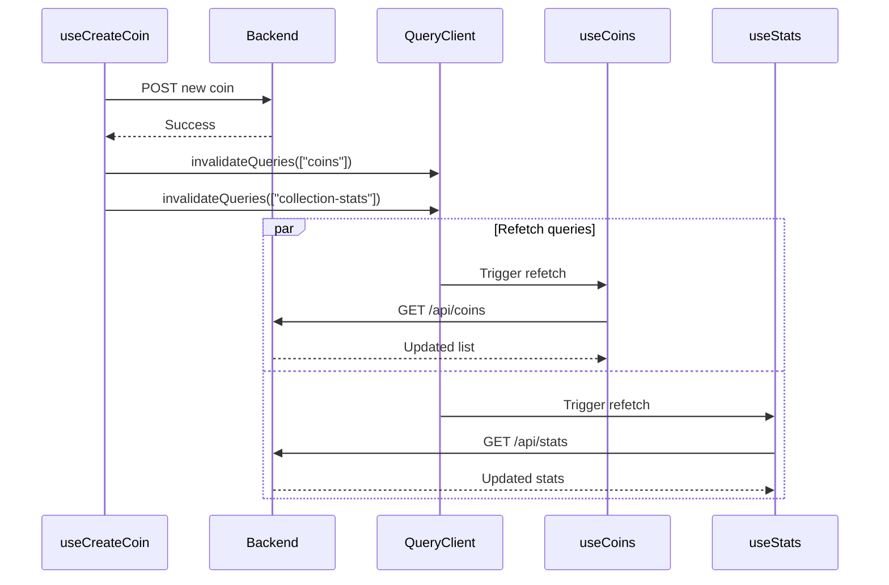
```mermaid
sequenceDiagram
    participant Mutation as useCreateCoin
    participant API as Backend
    participant Cache as QueryClient
    participant Query1 as useCoins
    participant Query2 as useStats

    Mutation->>API: POST new coin
    API-->>Mutation: Success
    Mutation->>Cache: invalidateQueries(["coins"])
    Mutation->>Cache: invalidateQueries(["collection-stats"])
    
    par Refetch queries
        Cache->>Query1: Trigger refetch
        Query1->>API: GET /api/coins
        API-->>Query1: Updated list
        and
        Cache->>Query2: Trigger refetch
        Query2->>API: GET /api/stats
        API-->>Query2: Updated stats
    end
```

---

## Authentication Flow

> **Note**: CoinStack is single-user, no authentication required.

All endpoints are open. CORS is configured for localhost development.

---

## Error Handling Flow

### Backend Error

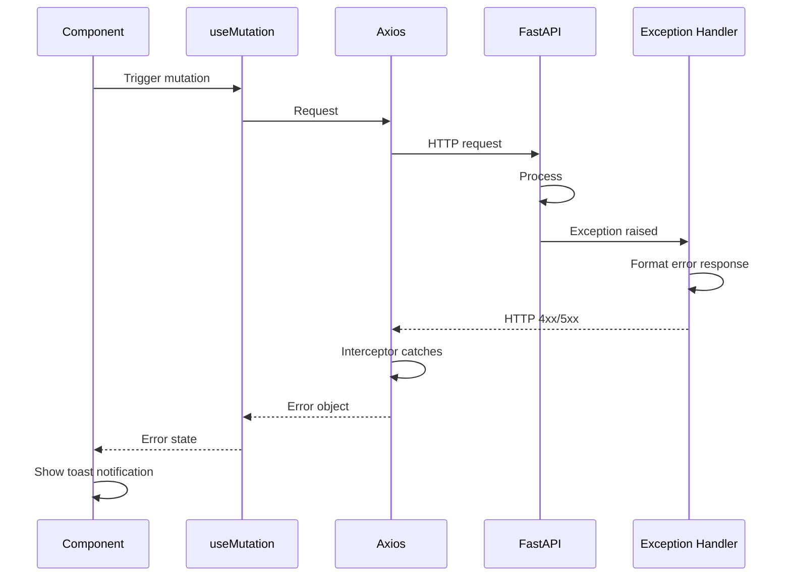
```mermaid
sequenceDiagram
    participant UI as Component
    participant Hook as useMutation
    participant API as Axios
    participant Backend as FastAPI
    participant Handler as Exception Handler

    UI->>Hook: Trigger mutation
    Hook->>API: Request
    API->>Backend: HTTP request
    Backend->>Backend: Process
    Backend->>Handler: Exception raised
    Handler->>Handler: Format error response
    Handler-->>API: HTTP 4xx/5xx
    API->>API: Interceptor catches
    API-->>Hook: Error object
    Hook-->>UI: Error state
    UI->>UI: Show toast notification
```

### Frontend Validation Error

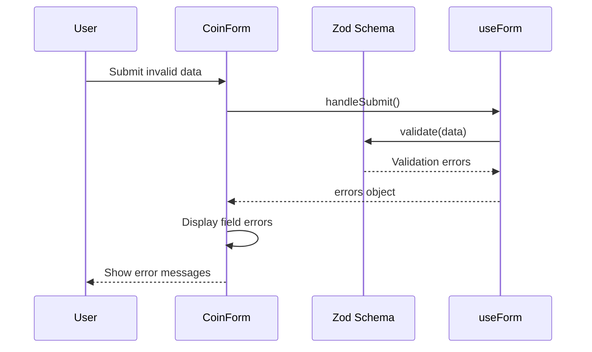
```mermaid
sequenceDiagram
    participant User
    participant Form as CoinForm
    participant Zod as Zod Schema
    participant Hook as useForm

    User->>Form: Submit invalid data
    Form->>Hook: handleSubmit()
    Hook->>Zod: validate(data)
    Zod-->>Hook: Validation errors
    Hook-->>Form: errors object
    Form->>Form: Display field errors
    Form-->>User: Show error messages
```

---

**Previous:** [05-DATA-MODEL.md](05-DATA-MODEL.md) - Database schema  
**Next:** [07-API-REFERENCE.md](07-API-REFERENCE.md) - API endpoints
